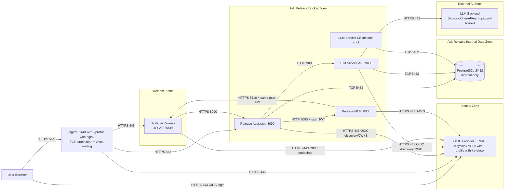

# Ask Release Docker Deployment for Secured On-Prem Environments

This repository provides a Docker Compose deployment pattern and enterprise documentation for running Ask Release on-premises in secured environments.

## 0) About this documentation

This repository ships two documents, one compose stack each:

| Document | Covers | Compose file |
|---|---|---|
| `README.md` (this file) | **Production deployment** of the CORE services. External Postgres, Release, IdP, LLM endpoint. Secure connectivity, sizing, RBAC, backup/DR, monitoring, private-CA trust. | `docker-compose.yaml` (root) |
| [test-lab/README.md](test-lab/README.md) | **Lab / local-stack deployment**. Local Keycloak, local Digital.ai Release, local PostgreSQL, optional nginx reverse proxy, lab setup recipes, troubleshooting for lab-only issues. | `test-lab/docker-compose.yaml` |
| [test-lab/QUICK-START.md](test-lab/QUICK-START.md) | **Guided quick install** for the full local HTTP lab stack (`with-llm-service`, `with-postgres`, `with-release`, `with-keycloak`) with step-by-step explanation. | `docker-compose.yaml` + `test-lab/docker-compose.yaml` |

The split mirrors the compose-file split: the CORE compose (`docker-compose.yaml`)
ships the three production services (release-assistant, release-mcp,
llm-service), and the TEST compose (`test-lab/docker-compose.yaml`) ships
the opt-in lab services (keycloak, nginx, postgres, release). For
local-lab end-to-end runs, combine them with `-f docker-compose.yaml
-f test-lab/docker-compose.yaml`. Always pass `--project-directory .` so
Compose resolves `extends` paths against the project root.

Both documents cross-reference each other. Every section that is lab-only
links to the relevant test-lab/README.md section; every section that is
production-only links back here.

## 1) Scope and deployment model

In this on-prem model, the customer runs and operates:

- Release Assistant
- Release MCP
- LLM Service (API and DB init)
- PostgreSQL (customer-managed or optionally local in this compose)
- Digital.ai Release (existing customer installation, or optional local container from this repo)
- OIDC Identity Provider (customer-managed or Digital.ai identity endpoint)
- LLM backend/provider endpoint access

No runtime dependency on Digital.ai SaaS control plane is required if identity and model provider are customer-managed.

Single-host Docker deployment; not high-availability. See §27.

## 2) Reference architecture



Container-internal DNS aliases:

Each service is also published under an `*.example.digital.ai.local` alias on the `ask-release-net` bridge (e.g. `release`, `release-mcp`, `release-assistant`, `llm-service-api`). These aliases let the components address each other by the same FQDN the public URL uses, which keeps TLS SNI/cert SAN chains and Release's `RELEASE_PUBLIC_URL` / `RELEASE_ASSISTANT_PUBLIC_URL` consistent for local-lab testing. The short `service` hostnames still work for plain HTTP inside the bridge.

## 3) Required network flows

| Source | Destination | Port | Protocol | Required for |
|---|---|---:|---|---|
| User browser | Digital.ai Release | 5516 | HTTPS | Ask Release UI entry (direct) |
| User browser | nginx ingress (only with `--profile with-nginx`) | 5443 | HTTPS | Single ingress for the Ask Release services that have a public vhost (Assistant, optionally Release / Keycloak) |
| nginx ingress | Release / Assistant / Keycloak | 5516 / 8090 / 8080 | HTTP | vhost proxy to each backend that has a public vhost (only with `--profile with-nginx`) |
| Release UI (browser context) | Release Assistant | 8090 | HTTPS | Chat requests (direct, when nginx is not in the path) |
| Release Assistant | Release MCP | 8000 | HTTP/HTTPS | Tool execution |
| Release MCP | Digital.ai Release API | 5516 | HTTPS | Release data/actions as user |
| Release Assistant | LLM Service API | 9000 | HTTP/HTTPS | Prompt/inference orchestration |
| Release Assistant | PostgreSQL | 5432 | TCP | Conversations/session metadata (internal data zone) |
| LLM Service API | PostgreSQL | 5432 | TCP | Provider/tenant/model config (internal data zone) |
| LLM Service DB Init | PostgreSQL | 5432 | TCP | Schema migrations + seed data (internal data zone) |
| Release Assistant | OIDC provider | 443 | HTTPS | Token discovery/JWKS validation |
| LLM Service API | OIDC provider | 443 | HTTPS | Token discovery/JWKS validation |
| LLM Service API | LLM provider endpoint | 443 | HTTPS | Model inference |
| User browser | OIDC provider | 443 | HTTPS | OIDC login redirect + token issuance |
| Release (OIDC client) | OIDC provider | 443 | HTTPS | Authorization, token, JWKS, userinfo, logout |
| Release MCP | OIDC provider | 443 | HTTPS | JWKS validation, issuer discovery |
| Local Keycloak (optional `--profile with-keycloak`) | Container network `ask-release-net` | 8080, 9000 | HTTP | Internal IdP for Assistant/MCP/LLM/Release when running with local Keycloak |

## 4) Security model and RBAC enforcement

- Ask Release does not replace Release authorization; it delegates authorization to Release APIs.
- Release Assistant accepts user-authenticated chat requests and forwards user token context.
- Release MCP calls Release API using the authenticated user token (not elevated service credentials in bearer-token mode).
- Release enforces user permissions, so responses are scoped to what the user can already access.
- If a user cannot view or modify an object directly in Release, Ask Release cannot expose or mutate it.

Token flow:

1. User authenticates to Release through OIDC.
2. Release UI sends chat request to Assistant with user JWT.
3. Assistant validates JWT against issuer/JWKS.
4. Assistant calls MCP with user context.
5. MCP calls Release API with the same user security context.
6. Release RBAC and permissions decide data visibility and action allow/deny.

## 5) Sizing guidelines (TODO: review)

Sizing depends on concurrent interactive users, number of parallel Ask Release requests, and model response latency.

Assumptions used for tiers:

- 1 interactive user creates bursts of 1 request every 20-40 seconds.
- Parallel requests are mostly concentrated at top of hour and release windows.
- LLM inference compute is externalized to LLM provider; local sizing mainly covers orchestration, auth, and storage.

| Tier | Concurrent users | Parallel Ask requests | Recommended vCPU | Recommended memory | Storage baseline |
|---|---:|---:|---:|---:|---:|
| Small | 20-50 | 5-15 | 8 | 24 GiB | 100 GiB |
| Medium | 50-200 | 15-60 | 16 | 48 GiB | 300 GiB |
| Large | 200-600 | 60-180 | 32 | 96 GiB | 1 TiB |

Suggested component split (starting point):

- Small:
  - Assistant: 2 vCPU / 4-6 GiB
  - MCP: 1 vCPU / 2-4 GiB
  - LLM Service API: 2 vCPU / 6-8 GiB
  - PostgreSQL: 2-3 vCPU / 8 GiB / fast SSD
- Medium:
  - Assistant: 4 vCPU / 8-12 GiB
  - MCP: 2 vCPU / 4-6 GiB
  - LLM Service API: 4 vCPU / 12-16 GiB
  - PostgreSQL: 4 vCPU / 16 GiB / fast SSD
- Large:
  - Assistant: 8 vCPU / 16-24 GiB (consider 2 replicas behind LB)
  - MCP: 4 vCPU / 8-12 GiB (consider 2 replicas)
  - LLM Service API: 8 vCPU / 24-32 GiB (consider 2+ replicas)
  - PostgreSQL: 8 vCPU / 32 GiB / provisioned IOPS SSD, backup + PITR

Scaling considerations:

- Scale Assistant and LLM Service API horizontally first for burst handling.
- Keep MCP stateless and horizontally scalable when Release API limits permit.
- Track p95 end-to-end response latency, queue depth, DB connections, and token validation latency.
- For large tier, place PostgreSQL on dedicated host/service and tune max connections and autovacuum.

## 6) Prerequisites

- Docker Engine + Docker Compose plugin
- Connectivity to image registry hosting:
  - `xebialabsunsupported/dai-release-assistant`
  - `xebialabsunsupported/dai-release-mcp`
  - `docker.usw2mgt.dev.digitalai.cloud/digital-ai/k6i-llm-service/llm-service-api`
  - `docker.usw2mgt.dev.digitalai.cloud/digital-ai/k6i-llm-service/llm-service-dbinit`
- WARNING: `xebialabsunsupported/*` images are for internal usage only. For production documentation and production deployments, use `xebialabs/*` images.
- **OIDC identity provider** (Okta, Microsoft Entra ID, Ping Identity, Auth0, or any compliant OIDC provider) with JWKS endpoint reachable from Assistant and LLM service. For the full IdP client setup walkthrough, see §8.3.
- **Digital.ai Release** instance reachable from the host running the CORE services on the HTTPS port (default `5516`). Minimum supported version: `26.1.3` (see §21). The optional `with-release` lab profile is documented in [test-lab/README.md §3](test-lab/README.md#3-local-digitalai-release--profile-with-release).
- **PostgreSQL 14+** provisioned and reachable from the host running the CORE services. The optional `with-postgres` lab profile is documented in [test-lab/README.md §1](test-lab/README.md#1-overview). For the customer-managed Postgres production path, see §8.1.
- LLM provider endpoint + credentials (or run the local LLM service via `--profile with-llm-service`)
- For the lab `with-nginx` profile only: TLS cert (with full chain) and key at `test-lab/nginx/certs/tls.crt` and `test-lab/nginx/certs/tls.key`, covering every vhost you intend to serve. See [test-lab/README.md §5](test-lab/README.md#5-reverse-proxy--https-ingress-production-grade-nginx) for the cert format and a self-signed local-lab example. (The `with-nginx` profile is a lab profile; the production equivalent is a corporate load balancer or WAF in front of the CORE services.)

## 7) Repository layout

```text
 .
├── release-assistant/
│   ├── compose.yaml
│   ├── config/
│   │   └── release-ai-assistant-config.yaml       # mirrors k8s configmap; LLM endpoint + model are env-driven
│   └── logs/                                       # runtime app logs (gitignored)
├── dai-release-mcp/
│   ├── compose.yaml
├── docker-compose.yaml                             # CORE services (release-assistant, release-mcp, llm-service)
├── docker-compose.override.yaml.example            # opt-in CORE hardening overlay (§10.5)
├── docker-compose.with-internal-ca.yaml            # opt-in internal-CA trust overlay (§28)
├── certs/                                           # CA trust material generated by install-internal-ca.sh (gitignored)
│   ├── .gitkeep
│   ├── README.md
│   ├── cacerts.jks                                  # JDK truststore for release-assistant
│   └── ca-bundle.pem                                # OpenSSL bundle for release-mcp + llm-service-api
├── install-internal-ca.sh                           # one-shot CA installer (idempotent)
├── llm-service/
│   └── compose.yaml
├── test-lab/                                           # TEST/lab infrastructure (combine with -f)
│   ├── docker-compose.yaml                         # test services: keycloak, nginx, postgres, release
│   ├── docker-compose.override.yaml.example        # opt-in TEST hardening overlay (§10.5)
│   ├── docker-compose.with-internal-ca.yaml        # opt-in internal-CA trust overlay for the test `release` service (§28)
│   ├── keycloak/                                   # opt-in local Keycloak IdP (--profile with-keycloak)
│   │   ├── compose.yaml
│   │   └── data/
│   │       └── xl-platform-realm.json              # pre-seeded realm (users, clients, roles)
│   ├── nginx/                                      # opt-in reverse proxy (--profile with-nginx)
│   │   ├── compose.yaml
│   │   ├── nginx.conf                              # main config; upstreams + shared TLS settings; includes conf.d/*.conf
│   │   ├── conf.d/
│   │   │   ├── 01-assistant.conf                   # Assistant vhost (always)
│   │   │   ├── 04-release.conf                     # Digital.ai Release vhost (--profile with-release)
│   │   │   └── 05-keycloak.conf                    # Keycloak vhost (--profile with-keycloak)
│   │   ├── certs/                                  # TLS cert + key + JKS truststore + PEM bundle (gitignored)
│   │   └── logs/                                   # runtime nginx logs (gitignored)
│   ├── postgres/                                   # opt-in local PostgreSQL (--profile with-postgres)
│   │   ├── compose.yaml
│   │   └── initdb/                                 # run once on first postgres startup
│   │       ├── 01_create_users.sql                 # Assistant + LLM service roles
│   │       ├── 02_create_databases.sql             # Assistant + LLM service databases
│   │       ├── 03_create_release_users.sql         # optional Release roles (with --profile with-release)
│   │       └── 04_create_release_databases.sql     # optional Release databases (with --profile with-release)
│   ├── release/                                    # opt-in local Digital.ai Release (--profile with-release)
│   │   ├── compose.yaml
│   │   ├── default-conf/
│   │   │   └── xl-release.conf.template            # read-only HOCON template mounted into the image default-conf path
│   │   ├── conf/                                   # bind-mounted into the container for runtime overrides + license
│   │   │   ├── .gitignore                          # excludes license/keystore/other runtime artifacts
│   │   │   ├── xl-release.conf                     # active HOCON config (create by copying the template into conf/; typically not committed)
│   │   │   ├── xl-release-license.lic              # local Release license (gitignored)
│   │   │   └── ...                                 # other image-default config files (wrapper, logback, etc.)
│   │   └── logs/                                   # runtime Release logs (gitignored)
├── .env                                            # your customised env (gitignored; copy from .env.base and edit)
├── .env.base                                       # checked-in defaults: images, ports, hostnames, auth, OIDC
├── README.md                                       # this file (production / CORE deployment)
└── test-lab/
    ├── README.md                                   # lab / local-stack deployment (test profiles)
    ├── docker-compose.yaml                         # test services: keycloak, nginx, postgres, release
```

Notes:

- The repo is split into a CORE compose (`docker-compose.yaml` at root) and a TEST compose (`test-lab/docker-compose.yaml`). For local-lab end-to-end runs, combine them with `-f docker-compose.yaml -f test-lab/docker-compose.yaml`. Always pass `--project-directory .` so Compose resolves `extends` paths against the project root. The two documents ([README.md](README.md) for CORE, [test-lab/README.md](test-lab/README.md) for TEST) map 1:1 to the two compose files; see §0 above.
- `.env.base` is the single checked-in defaults file. It sets container image tags, exposed host ports, public FQDNs, derived public URLs, `OAUTH2_TOKEN_CLIENT_ID` / `OAUTH2_TOKEN_CLIENT_SECRET`, and `OIDC_ISSUER_URI`. Every other env var consumed by the per-service compose files has an inline `${VAR:-default}` fallback baked into the compose file itself. `.env.base` ships commented templates for the most common overrides; copy `.env.base` to `.env` (gitignored) and uncomment / set the vars you want to override.
- The initdb scripts run alphabetically on first PostgreSQL startup. Users are created before their databases so role ownership can be applied during `CREATE DATABASE`.

The top-level `docker-compose.yaml` aggregates the CORE per-service compose files via `extends`, matching the split compose style used in `dai-release-assistant/docker`. The TEST compose file in `test-lab/` aggregates the test infra the same way.

By default, the stack assumes customers already have Release, an IdP, and PostgreSQL provisioned (i.e. point `RELEASE_PUBLIC_URL` / `OIDC_ISSUER_URI` / `POSTGRES_HOSTNAME` at the managed services).
The local Release / Keycloak / PostgreSQL containers are optional and only enabled with their respective `with-*` profiles (combine with `--profile with-llm-service` for the full local lab).

Deployment modes:

For scenario-specific installation instructions, see §8.1/§8.2/§8.3 (production paths) and [test-lab/README.md §9-§10](test-lab/README.md#9-hybrid-scenario-on-prem-assistant--saas-llm) (hybrid / BYO-LLM scenarios).

For a guided local-lab install flow (HTTP, no nginx/TLS), see
[test-lab/QUICK-START.md](test-lab/QUICK-START.md).

 | Mode | Command | Local LLM Service | Local Release | Reverse proxy |
 |---|---|---|---|---|
 | Default (production-like, external LLM service/DB/Release/IdP) | `docker compose --profile with-llm-service up -d llm-service-api release-mcp release-assistant` (run `llm-service-dbinit` first) | Yes | No | No |
 | Core without local LLM | `docker compose up -d release-mcp release-assistant` | No | No | No |
 | Full local lab (with TEST compose) | `docker compose -f docker-compose.yaml -f test-lab/docker-compose.yaml --profile with-release --profile with-postgres --profile with-llm-service up -d ...` (run `llm-service-dbinit` first) | Yes | Yes | No |
 | Production ingress (HTTPS) | place a corporate LB / WAF in front of the CORE services. The `with-nginx` profile is a lab-only convenience for the same pattern; see [test-lab/README.md §4-§5](test-lab/README.md#4-optional-reverse-proxy--profile-with-nginx) | optional | optional | optional (lab proxy) |

All commands assume `--project-directory .` is passed and `.env` (your customised copy of `.env.base`, gitignored) is present in the project root so Compose reads it implicitly. No `--env-file` flag is needed. See [test-lab/README.md §8](test-lab/README.md#8-lab-setup-recipes) for copy/paste lab recipes (replaces the previous SETUP.md).

## 8) Quick start

1. Copy and edit the env file:

```bash
cp .env.base .env
# edit .env to set hostnames, OAuth client credentials, IdP issuer,
# and any other per-deployment override
```

> **Tip**: `.env.base` ships commented templates for the most common overrides (DB credentials, proxy, AI/LLM endpoint, etc.). `.env` is gitignored. Compose reads `.env` from the project root implicitly, so no `--env-file` flag is needed.

2. Fill at minimum (in `.env`):

- `OAUTH2_TOKEN_CLIENT_ID`
- `OAUTH2_TOKEN_CLIENT_SECRET`
- `OIDC_ISSUER_URI`
- `RELEASE_PUBLIC_URL`
- `RELEASE_INTERNAL_URL`
- `RELEASE_MCP_INTERNAL_URL`
- `MCP_OAUTH_AUDIENCE` (defaults to `${OAUTH2_TOKEN_CLIENT_ID}`; override only if MCP must validate a different audience)
- `RELEASE_ASSISTANT_DB_URL_SUFFIX`, `RELEASE_ASSISTANT_DB_USERNAME`, `RELEASE_ASSISTANT_DB_PASSWORD` (defaults point at the local Postgres container)

`MCP_OAUTH_ISSUER`, `MCP_OAUTH_JWKS_URL`, `OIDC_JWK_SET_URI`, and the local Release OIDC URIs (`RELEASE_OIDC_ISSUER`, `RELEASE_OIDC_{KEY_RETRIEVAL,ACCESS_TOKEN,USER_AUTHORIZATION,LOGOUT}_URI`) are derived from `OIDC_ISSUER_URI` and the MCP issuer by the per-service compose files. Override any of them only if your IdP uses a non-standard layout.

For default mode with local LLM (`docker compose --profile with-llm-service up ...`), also set:

- `LLM_SERVICE_DEFAULT_PROVIDER_CONFIG`
- `LLM_SERVICE_DEFAULT_SYSTEM_MODEL_ALIAS_MAPPINGS` (optional, base64 encoded JSON)
- `LLM_DB_HOST`, `LLM_DB_NAME`, `LLM_DB_USERNAME`, `LLM_DB_PASSWORD` (default to the local Postgres)

 3. Start the default stack (local LLM + core services):

```bash
docker compose --project-directory . \
  --profile with-llm-service up llm-service-dbinit
docker compose --project-directory . \
  --profile with-llm-service up -d llm-service-api release-mcp release-assistant
```

If your IdP / Release / LLM endpoints are signed by an internal corporate
CA, run `./install-internal-ca.sh <corp-ca-bundle.pem>` and add
`-f docker-compose.with-internal-ca.yaml` to every `docker compose`
command in this quick start (see §28).

4. Optional core mode without local LLM (for external LLM service endpoint setups):

```bash
docker compose --project-directory . \
  up -d release-mcp release-assistant
```

5. Optional local PostgreSQL for default mode (combines CORE + TEST compose):

```bash
docker compose --project-directory . \
  -f docker-compose.yaml -f test-lab/docker-compose.yaml \
  --profile with-postgres up -d postgres
docker compose --project-directory . \
  -f docker-compose.yaml -f test-lab/docker-compose.yaml \
  --profile with-postgres --profile with-llm-service up llm-service-dbinit
docker compose --project-directory . \
  -f docker-compose.yaml -f test-lab/docker-compose.yaml \
  --profile with-postgres --profile with-llm-service up -d llm-service-api release-mcp release-assistant
```

For lab-only stacks (local Digital.ai Release, local Keycloak, optional nginx reverse proxy), full local lab recipes, the BYO-LLM and Hybrid install scenarios, lab setup recipes, and test-stack troubleshooting, see [test-lab/README.md](test-lab/README.md).

### 8.0 Lab profiles and local stack

> **Lab profiles only.** This section is a pointer to the lab/lab-stack
> documentation. The CORE deployment documented in this README does not
> depend on any `test-lab/` profile.

| Lab profile | Description | test-lab/README.md |
|---|---|---|
| `--profile with-keycloak` | Local Keycloak IdP preloaded with the `xl-platform` realm | [§2](test-lab/README.md#2-local-keycloak-idp--profile-with-keycloak) |
| `--profile with-release` | Local Digital.ai Release container (uses `test-lab/release/conf/` bind mount + HOCON template) | [§3](test-lab/README.md#3-local-digitalai-release--profile-with-release) |
| `--profile with-postgres` | Local PostgreSQL 18 for non-production / PoC runs | (see [test-lab/README.md §1](test-lab/README.md#1-overview) and §8 recipes) |
| `--profile with-nginx` | Optional nginx reverse proxy terminating TLS in front of the public-facing vhosts | [§4](test-lab/README.md#4-optional-reverse-proxy--profile-with-nginx), [§5](test-lab/README.md#5-reverse-proxy--https-ingress-production-grade-nginx) |
| (Hybrid / BYO-LLM) | On-Prem Assistant + SaaS LLM, or customer-managed local LLM Service | [§9](test-lab/README.md#9-hybrid-scenario-on-prem-assistant--saas-llm), [§10](test-lab/README.md#10-byo-llm-scenario-llm-service-self-hosted) |
| (Lab setup recipes) | 6 copy/paste workflows covering each combination of profiles | [§8](test-lab/README.md#8-lab-setup-recipes) |
| (Lab troubleshooting) | nginx-cert, external-network-flag, chown-permission-denied | [§13](test-lab/README.md#13-lab-troubleshooting) |

For the **production install scenarios** (external customer-managed
Postgres / Release / OIDC IdP), see §8.1 / §8.2 / §8.3 below. For
lab-stack day-to-day operations (logs, restart, pull, health checks
with the local Release), see
[test-lab/README.md §7](test-lab/README.md#7-common-operations-on-the-lab-stack).


- PostgreSQL consolidation is supported: customers can host Assistant and LLM service data on the same PostgreSQL server using separate databases/schemas.

### 8.1 Install scenario: External (customer-managed) PostgreSQL

> **Production path.** Use this scenario when the customer operates
> PostgreSQL outside the `with-postgres` lab profile: RDS, Aurora, Azure
> Database for PostgreSQL, on-prem PostgreSQL, or any other managed
> service. The CORE services connect to the operator's database over
> the network.

#### 8.1.1 Topology

```text
   ┌──────────────────┐         ┌──────────────────────────┐
   │ release-assistant│────────▶│                          │
   └──────────────────┘         │  customer-managed        │
                                │  PostgreSQL              │
   ┌──────────────────┐         │  (RDS / Aurora / Azure / │
   │   release-mcp    │────────▶│   on-prem)               │
   └──────────────────┘         │                          │
                                │  dbs: dai_assistant,     │
   ┌──────────────────┐         │       dai_llm            │
   │ llm-service-api  │────────▶│                          │
   └──────────────────┘         └──────────────────────────┘
```

Both the Assistant and the LLM service connect to the same Postgres
server but use separate databases (`dai_assistant` and `dai_llm`) with
separate users. The MCP does not connect to Postgres directly; it
inherits auth from the Assistant's bearer token when calling Release.

#### 8.1.2 Prerequisites

- PostgreSQL 14 or later reachable from the host running the CORE
  services.
- A database user `dai_assistant` with login and CRUD rights on a
  database named `dai_assistant`.
- A database user `dai_llm` with login and CRUD rights on a database
  named `dai_llm`.
- (Optional, recommended) TLS for the Postgres connection. The
  operator's CA chain must be installed via §28.
- A reachable enterprise IdP (see §8.3) and Digital.ai Release (see
  §8.2). These are separate prerequisites; this scenario assumes both
  are in place.

#### 8.1.3 Init SQL

Run this once on the customer-managed Postgres (via `psql` or your
provider's query interface). Substitute strong passwords; do not reuse
the placeholder values.

```sql
-- Create roles (login users). Replace the placeholders.
CREATE USER dai_assistant WITH PASSWORD '<strong-password-1>';
CREATE USER dai_llm        WITH PASSWORD '<strong-password-2>';

-- Create databases owned by their respective users.
CREATE DATABASE dai_assistant OWNER dai_assistant ENCODING 'UTF8';
CREATE DATABASE dai_llm        OWNER dai_llm        ENCODING 'UTF8';

-- The Assistant user needs CRUD on its database. The `public` schema
-- is the default; the Assistant creates its tables there.
GRANT ALL PRIVILEGES ON DATABASE dai_assistant TO dai_assistant;
GRANT ALL PRIVILEGES ON DATABASE dai_llm        TO dai_llm;

-- The LLM service uses Alembic for migrations; the user needs full
-- DDL on its database so `llm-service-dbinit` can manage the schema.
-- (Already implied by OWNER + GRANT ALL PRIVILEGES; listed for
-- clarity.)
```

For stricter production hardening, replace `GRANT ALL PRIVILEGES ON
DATABASE` with schema-level grants (e.g.
`GRANT USAGE, CREATE ON SCHEMA public TO dai_assistant;` +
`GRANT SELECT, INSERT, UPDATE, DELETE ON ALL TABLES IN SCHEMA public
TO dai_assistant;`). The LLM service's `llm-service-dbinit` image will
create new tables in the `public` schema and may also create additional
schemas (`common`, `tenant_default`) depending on the version; verify
with `\\dn` after the first dbinit run.

#### 8.1.4 `.env` overrides

```bash
# Point at the customer Postgres host
POSTGRES_HOSTNAME=mypostgres.corp.example.com
POSTGRES_PORT=5432

# Assistant DB credentials
RELEASE_ASSISTANT_DB_USERNAME=dai_assistant
RELEASE_ASSISTANT_DB_PASSWORD=<strong-password-1>

# LLM DB credentials
LLM_DB_USERNAME=dai_llm
LLM_DB_PASSWORD=<strong-password-2>

# TLS for Postgres (recommended). SSLMODE controls verification level.
# Append ?sslmode=... to the JDBC URL. The LLM service picks up
# LLM_DB_PORT (defaults to POSTGRES_PORT) for its own connection.
#
# - require   : encrypt, trust the server cert against system CAs
# - verify-ca : encrypt, validate CA chain (operator's CA must be in certs/ca-bundle.pem; see §28)
# - verify-full : encrypt, validate CA chain + hostname match
#
# Example for verify-full with a corporate CA:
# RELEASE_ASSISTANT_DB_URL_SUFFIX=postgresql://${POSTGRES_HOSTNAME}:${POSTGRES_PORT}/dai_assistant?sslmode=verify-full
```

DB URL defaults: `release-assistant/compose.yaml` builds
`DB_URL_SUFFIX=postgresql://${POSTGRES_HOSTNAME}:${POSTGRES_PORT}/dai_assistant`
from the env vars above. The LLM service uses
`DAI_DB_SERVER=${LLM_DB_HOST:-${POSTGRES_HOSTNAME}}` and
`DAI_DB_PORT=${LLM_DB_PORT:-${POSTGRES_PORT}}`. Override `LLM_DB_HOST`
and `LLM_DB_PORT` directly in `.env` if the LLM DB lives on a
different host or port.

#### 8.1.5 Run

```bash
# 1) Run the LLM service dbinit (one-shot; creates the LLM DB schema)
docker compose -f docker-compose.yaml \
  --profile with-llm-service \
  up llm-service-dbinit

# 2) Start the CORE services. The Assistant creates its DB schema
# automatically on first connect (Spring Boot + Flyway/Liquibase; the
# image handles this).
docker compose -f docker-compose.yaml \
  --profile with-llm-service \
  up -d llm-service-api release-mcp release-assistant
```

The Assistant's first start performs its own schema migration; do not
skip this step. The MCP and LLM service API do not touch the schema.

#### 8.1.6 PITR / backup

For backup and restore, see §24. The PITR cadence is set on the
provider's side (RDS automated backup window, Azure DB retention
setting, etc.). The `llm-service-dbinit` image is idempotent and can
be rerun after a PITR restore to bring the LLM DB schema forward
(see §24.4 step 2).

#### 8.1.7 Troubleshooting

| Symptom | Likely cause | First checks |
|---|---|---|
| `Connection refused` on startup | Postgres host unreachable from the CORE host | `nc -zv ${POSTGRES_HOSTNAME} ${POSTGRES_PORT}`; check firewall / security group |
| `password authentication failed` | Wrong `RELEASE_ASSISTANT_DB_PASSWORD` / `LLM_DB_PASSWORD` | `psql -h ${POSTGRES_HOSTNAME} -U dai_assistant -d dai_assistant` from the host |
| `permission denied for schema public` | DB user missing CREATE on the schema | `GRANT CREATE ON SCHEMA public TO dai_assistant;` |
| `sslmode=verify-full` fails with `certificate verify failed` | Corporate CA not in `certs/ca-bundle.pem` | §28 install procedure; verify with `psql "sslmode=verify-full host=... user=..."` |
| `relation "flyway_schema_history" does not exist` (assistant) | Assistant DB is empty on first start; this is normal | The image creates the table on first start. If the error persists, the DB user lacks CREATE |

### 8.2 Install scenario: External (customer-managed) Digital.ai Release

> **Production path.** Use this scenario when the customer operates
> Digital.ai Release outside the `with-release` lab profile. The CORE
> services point at the operator's existing Release over the network.

#### 8.2.1 Topology

```text
   ┌──────────────────┐         ┌──────────────────────────┐
   │ release-assistant│────────▶│                          │
   └──────────────────┘         │  customer-managed        │
                                │  Digital.ai Release      │
   ┌──────────────────┐         │  (existing on-prem or    │
   │   release-mcp    │────────▶│   hosted deployment)     │
   └──────────────────┘         │                          │
                                │  min version: 26.1.3     │
   ┌──────────────────┐         │                          │
   │ llm-service-api  │         │                          │
   └──────────────────┘         └──────────────────────────┘
```

The MCP talks to Release over HTTPS using the user's bearer token
(forwarded from the Assistant). The LLM service does not talk to
Release directly.

#### 8.2.2 Prerequisites

- Digital.ai Release `26.1.3` or later (see §21).
- A valid Release license (server-locked or license server).
- An OIDC client set up on the customer Release (see §8.3 for the
  OIDC client setup walkthrough; the Release OIDC config mirrors the
  Assistant's OIDC config).
- Reachable from the host running the CORE services on the Release
  HTTPS port (default `5516`).
- (Optional, recommended) The operator's CA chain installed via §28
  if Release is signed by a private CA.

#### 8.2.3 `.env` overrides

```bash
# Public URL the browser hits (and the OIDC redirect_uri target).
# In production this is the customer's Release URL behind their own
# load balancer / TLS terminator.
RELEASE_PUBLIC_URL=https://release.corp.example.com:5516

# Public Assistant URL (drives the assistant-url config and OIDC config).
RELEASE_ASSISTANT_PUBLIC_URL=https://assistant.corp.example.com:8090

# Internal URL the MCP uses to reach Release. Same as RELEASE_PUBLIC_URL
# when there is no separate load balancer in front of Release. Set to
# the in-cluster / private URL if the CORE services run alongside
# Release in the same private network.
RELEASE_INTERNAL_URL=https://release.corp.example.com:5516
```

If the customer's Release is reachable over a private hostname that
differs from the public one (e.g. an internal `release.internal` vs
the public `release.corp.example.com`), set:

```bash
RELEASE_PUBLIC_URL=https://release.corp.example.com:5516   # browser / OIDC redirect
RELEASE_INTERNAL_URL=https://release.internal:5516           # MCP -> Release (private network)
```

The MCP picks up `RELEASE_BASE_URL` from `RELEASE_INTERNAL_URL`; the
Assistant picks up `RELEASE_BASE_URL` from `RELEASE_PUBLIC_URL` (used
for CORS).

#### 8.2.4 OIDC client config

The customer Release must be configured to trust the same OIDC
issuer as the Assistant. See §8.3.2 for the IdP-agnostic setup
(Standard flow, Standard token exchange, valid redirect URIs,
Audience mapper). The Release-specific extras are:

- The customer's Release needs a **confidential client** registered
  in the IdP with **Standard flow enabled**, the **valid redirect
  URI** `https://<release-public-fqdn>/oidc-login`, the same
  `dai-svc` scope, and the same audience (`OAUTH2_TOKEN_CLIENT_ID`
  — included via the `Client Audience` mapper on the Assistant
  client per §8.3.2).
- The Release must be configured to accept bearer tokens from the
  IdP for API access. In Release's `xl-release.conf` or admin UI,
  the OIDC provider URL must match `OIDC_ISSUER_URI`.

#### 8.2.5 Run

```bash
docker compose -f docker-compose.yaml \
  --profile with-llm-service \
  up -d llm-service-api release-mcp release-assistant
```

There is no `with-release` profile in this scenario; Release is not
started by the compose stack.

#### 8.2.6 Verification

After the CORE services are up:

```bash
# 1) The MCP can reach Release
docker compose -f docker-compose.yaml exec release-mcp \
  curl -fS ${RELEASE_INTERNAL_URL}/login

# 2) The Assistant can reach the MCP
docker compose -f docker-compose.yaml exec release-assistant \
  curl -fS http://release-mcp:8000/utility/healthcheck

# 3) End-to-end: log in to the Assistant UI, send a chat message that
#    triggers a Release tool call (e.g. "list the first 5 templates
#    in folder /Templates"). Verify the MCP tool call succeeds in
#    the assistant logs.
```

If the MCP cannot reach Release, check the `RELEASE_INTERNAL_URL` host
and port. If the chat fails with auth errors, verify the OIDC client
config (§8.3) and that the user's bearer token has the `dai-svc`
scope.

### 8.3 Install scenario: Enterprise OIDC identity provider

> **Production path.** Use this scenario when the customer operates an
> enterprise OIDC IdP (Okta, Microsoft Entra ID, Ping Identity, Auth0,
> or any compliant OIDC provider) instead of the in-stack
> `with-keycloak` lab profile. The CORE services validate JWTs
> against the operator's IdP.

#### 8.3.1 Topology

```text
   ┌──────────────────┐
   │ release-assistant│──┐
   └──────────────────┘  │
                        │  OIDC discovery + JWKS + userinfo
   ┌──────────────────┐  │
   │   release-mcp    │──┼──▶  ┌──────────────────────────┐
   └──────────────────┘  │     │  enterprise OIDC IdP     │
                         │     │  (Okta, Entra, Ping,     │
   ┌──────────────────┐  │     │   Auth0, ...)            │
   │ llm-service-api  │──┘     └──────────────────────────┘
   └──────────────────┘
```

All three CORE services validate bearer tokens from the same IdP. The
`dai-svc` scope (or audience) gates access to the Assistant.

#### 8.3.2 OIDC client setup (IdP-agnostic)

The Ask Release stack needs **two** OIDC client registrations in the
enterprise IdP — one for the **Release** instance and one for the
**Ask Release Assistant**. Both must be configured as below. The
specific IdP navigation (Keycloak "Capabilities" tab, Okta
"Allowed Clients" settings, etc.) varies by vendor; the conceptual
settings are the same.

**On the Release client registration** (the one Release uses to
authenticate users and that the Assistant exchanges user tokens
against):

| Setting | Value |
|---|---|
| Client type | Confidential |
| **Standard flow** | **Enabled** (this is the `authorization_code` grant; required for the browser login redirect) |
| **Valid redirect URIs** | `https://<release-public-fqdn>/oidc-login` (matches `${RELEASE_OIDC_REDIRECT_URI}` in `.env`); also add the post-logout variant `${RELEASE_OIDC_POST_LOGOUT_REDIRECT_URI}` if your IdP tracks it separately |
| Grant types | `authorization_code`, `refresh_token` |
| Scopes | `openid`, `dai-svc` (define `dai-svc` as a custom scope on the IdP if it doesn't exist) |
| Token type | JWT (RS256-signed) |
| ID token lifetime | 5-15 min (short-lived) |
| Access token lifetime | 30-60 min |
| Refresh token lifetime | 8-24 hours |

**On the Assistant client registration** (the one the Assistant
registers as `OAUTH2_TOKEN_CLIENT_ID`, used to exchange the user JWT
for a service-account token that the MCP forwards to Release):

| Setting | Value |
|---|---|
| Client type | Confidential |
| **Standard flow** | **Enabled** |
| **Standard token exchange** | **Enabled** (`urn:ietf:params:oauth:grant-type:token-exchange`). Without this, the Assistant's token-exchange request is rejected by the IdP and MCP gets no usable token. |
| Post-logout redirect URI | `https://<assistant-public-fqdn>` |
| Grant types | `authorization_code`, `client_credentials` (for service-to-service), `refresh_token` |
| Scopes | `openid`, `dai-svc` |
| Token type | JWT (RS256-signed) |
| ID token lifetime | 5-15 min (short-lived) |
| Access token lifetime | **30** minutes (30 min is the Ask Release default; align with your security policy) |
| Refresh token lifetime | 8-24 hours |

**Mappers (on the Assistant client):**

Add an **Audience** mapper so the exchanged token carries the
Release client ID in the `aud` claim. Without it, the exchanged
token only carries the Assistant's own client ID as audience, and
the MCP / LLM service reject it with an audience-validation error.

| Setting | Value |
|---|---|
| **Name** | `Client Audience` |
| **Mapper type** | `Audience` |
| **Included Client Audience** | the **client ID** of the Release registration above — the value of `RELEASE_OIDC_CLIENT_ID` (or `OAUTH2_TOKEN_CLIENT_ID` if you reuse the same client) |

Note the `client_id` and `client_secret` of the Assistant
registration — these become `OAUTH2_TOKEN_CLIENT_ID` and
`OAUTH2_TOKEN_CLIENT_SECRET` in `.env`. The Release registration's
`client_id` becomes `RELEASE_OIDC_CLIENT_ID` (defaults to
`OAUTH2_TOKEN_CLIENT_ID` if the two are the same client).

#### 8.3.4 `.env` overrides

```bash
# IdP issuer (use the value from your IdP's discovery doc)
OIDC_ISSUER_URI=https://<idp-issuer>

# Assistant's confidential client credentials
OAUTH2_TOKEN_CLIENT_ID=<client-id>
OAUTH2_TOKEN_CLIENT_SECRET=<client-secret>

# Scopes requested at login
OAUTH2_SCOPES="openid, dai-svc"

# JWKS URI (usually derived from OIDC_ISSUER_URI; override only if
# your IdP uses a non-standard layout)
OIDC_JWK_SET_URI=${OIDC_ISSUER_URI}/<jwks-path>

# MCP OIDC config (must match the Assistant's IdP)
MCP_OAUTH_ISSUER=${OIDC_ISSUER_URI}
MCP_OAUTH_JWKS_URL=${OIDC_JWK_SET_URI}
MCP_OAUTH_AUDIENCE=${OAUTH2_TOKEN_CLIENT_ID}

# LLM service OIDC config (must match the Assistant's IdP)
DAI_AUTH_ISSUER_PATTERN=${OIDC_ISSUER_URI}
```

If the enterprise IdP uses a CA chain that is not in the JDK or
`certifi` default trust stores, install the CA via §28.

#### 8.3.5 Run

```bash
docker compose -f docker-compose.yaml \
  --profile with-llm-service \
  up -d llm-service-api release-mcp release-assistant
```

There is no `with-keycloak` profile in this scenario; the in-stack
Keycloak is not started.

#### 8.3.6 Verification

```bash
# 1) The IdP's discovery doc is reachable and parses
curl -fS ${OIDC_ISSUER_URI}/.well-known/openid-configuration | jq .

# 2) The JWKS endpoint returns a key set
curl -fS ${OIDC_JWK_SET_URI} | jq '.keys | length'

# 3) Each CORE service can reach the IdP
docker compose -f docker-compose.yaml exec release-assistant \
  curl -fS ${OIDC_ISSUER_URI}/.well-known/openid-configuration
docker compose -f docker-compose.yaml exec release-mcp \
  curl -fS ${OIDC_ISSUER_URI}/.well-known/openid-configuration
docker compose -f docker-compose.yaml exec llm-service-api \
  curl -fS ${OIDC_ISSUER_URI}/.well-known/openid-configuration

# 4) End-to-end: log in to the Assistant UI, verify the user is
#    authenticated and the Assistant chat is functional.
```

If JWKS fetch fails with `unable to get local issuer certificate`,
the corporate CA is missing — see §28. If the user can log in but
chat fails with `401 Unauthorized`, verify the `dai-svc` scope is
included in the access token (decode at jwt.io).

### 8.4 Common operations (CORE)

All commands below assume `.env` (your customised copy of `.env.base`)
is present in the project root. Compose reads it implicitly - no
`--env-file` flag is needed. These commands operate on the CORE
services only (release-assistant, release-mcp, llm-service). For
lab-stack variants that include the local Digital.ai Release, see
[test-lab/README.md §7](test-lab/README.md#7-common-operations-on-the-lab-stack).

#### 8.4.1 List running services

```bash
docker compose ps
```

#### 8.4.2 Tail logs

Default CORE stack (with local LLM service):

```bash
docker compose logs -f release-mcp llm-service-api release-assistant
```

CORE only (no local LLM service):

```bash
docker compose logs -f release-mcp release-assistant
```

#### 8.4.3 Restart services

Default CORE stack:

```bash
docker compose restart release-mcp llm-service-api release-assistant
```

CORE only:

```bash
docker compose restart release-mcp release-assistant
```

#### 8.4.4 Pull images

```bash
docker compose pull release-mcp llm-service-api release-assistant llm-service-dbinit
```

#### 8.4.5 Run LLM service DB init (one-shot)

```bash
docker compose --profile init up llm-service-dbinit
```

#### 8.4.6 Stop and remove containers

```bash
docker compose down --remove-orphans
```

#### 8.4.7 Health checks

Default CORE stack (Assistant + MCP + local LLM service):

```bash
curl -fsS "http://localhost:${ASSISTANT_PORT:-8090}/actuator/health/liveness" && echo " - assistant ok"
curl -fsS "http://localhost:${MCP_PORT:-8000}/utility/healthcheck" && echo " - mcp ok"
curl -fsS "http://localhost:${LLM_SERVICE_PORT:-9000}/llm/utility/ping" && echo " - llm-service ok"
```

CORE only (no local LLM service):

```bash
curl -fsS "http://localhost:${ASSISTANT_PORT:-8090}/actuator/health/liveness" && echo " - assistant ok"
curl -fsS "http://localhost:${MCP_PORT:-8000}/utility/healthcheck" && echo " - mcp ok"
```

The `${VAR:-default}` shell substitution lets the curl commands run
without sourcing `.env` first; values default to the published ports
when not exported.

## 9) Health and verification

- Assistant liveness: `http://<assistant-host>:8090/actuator/health/liveness`
- MCP health: `http://<mcp-host>:8000/utility/healthcheck`
- LLM service ping (when local LLM mode enabled): `http://<llm-host>:9000/llm/utility/ping`

Suggested checks:

1. Curl assistant and mcp endpoints (plus llm endpoint in local LLM mode).
2. Send Ask Release test prompt in Release UI.
3. Confirm prompt produces Release-scoped data for user.

Or run the bundled health-check sequences (see [Common operations (CORE)](#common-operations-core)):

```bash
# Default stack (Assistant + MCP + local LLM service)
curl -fsS "http://localhost:${ASSISTANT_PORT:-8090}/actuator/health/liveness" && echo " - assistant ok"
curl -fsS "http://localhost:${MCP_PORT:-8000}/utility/healthcheck" && echo " - mcp ok"
curl -fsS "http://localhost:${LLM_SERVICE_PORT:-9000}/llm/utility/ping" && echo " - llm-service ok"

# Core only (no local LLM service)
curl -fsS "http://localhost:${ASSISTANT_PORT:-8090}/actuator/health/liveness" && echo " - assistant ok"
curl -fsS "http://localhost:${MCP_PORT:-8000}/utility/healthcheck" && echo " - mcp ok"

# Full local stack (also includes optional local Release)
curl -fsS "http://localhost:${ASSISTANT_PORT:-8090}/actuator/health/liveness" && echo " - assistant ok"
curl -fsS "http://localhost:${MCP_PORT:-8000}/utility/healthcheck" && echo " - mcp ok"
curl -fsS "http://localhost:${LLM_SERVICE_PORT:-9000}/llm/utility/ping" && echo " - llm-service ok"
curl -fsS "http://localhost:${RELEASE_HTTP_PORT:-5516}/s/actuator/health/liveness" && echo " - release ok"
```

## 10) Secure connectivity guidance for enterprises

- Terminate TLS at ingress/LB for Assistant, MCP, and LLM Service API.
- Use internal PKI certs and trust bundles in containers when TLS inspection/proxying is enabled.
- Restrict east-west traffic by firewall/security groups to exact flows in section 3.
- Use allowlist egress from LLM Service API only to required LLM provider domains.
- Store secrets in external vault/secret manager and inject at runtime; do not commit `.env`.
- Rotate OAuth secrets, provider keys, and DB passwords on regular cadence.

### 10.0 IdP client setup (Keycloak)

> **Keycloak-specific implementation.** The IdP-agnostic requirements
> (Standard flow, Standard token exchange, valid redirect URIs,
> Audience mapper) are in §8.3.2. This section is the Keycloak
> navigation to satisfy those requirements on the Assistant client
> registration.

The Assistant uses the OAuth2 **token-exchange** grant
(`urn:ietf:params:oauth:grant-type:token-exchange`) to swap a user JWT
for a service-account token it forwards to MCP, which then
re-exchanges it for a user-scoped Release API token. For this chain
to succeed, the IdP client identified by `OAUTH2_TOKEN_CLIENT_ID` must
be configured as below.

**On the client matching `OAUTH2_TOKEN_CLIENT_ID`:**

1. **Settings** tab -> **Valid redirect URIs**: add
   `https://<assistant-public-fqdn>/login/oauth2/code/*` (Spring
   Security default).
2. **Capabilities** tab -> enable **Standard flow** (required for
   the browser login redirect).
3. **Capabilities** tab -> enable **Standard token exchange**.
   - Without this, the Assistant's token-exchange request is
     rejected by the IdP and MCP gets no usable token.
4. **Access token lifespan** -> set to **30** (minutes).
   - Controls how long the exchanged token remains valid. 30 min is
     the Ask Release default; align with your security policy.
     Shorter = less blast radius on leak; longer = fewer re-auth
     prompts.
5. **Mappers** tab -> **Add mapper**:
   - **Name**: `Client Audience`.
   - **Mapper type**: `Audience`.
   - **Included Client Audience**: the client ID of the local
     (trial) Release registration -- the value of
     `RELEASE_OIDC_CLIENT_ID`.
   - **Save**.

   The mapper appends the Release client ID to the `aud` claim of
   exchanged tokens. Without it, the exchanged token only carries
   the Assistant's own client ID as audience, and MCP/LLM service
   reject it with an audience-validation error.

**On the Release client registration** (the `xl-release` client in
the local Keycloak realm), repeat the same configuration:

1. **Settings** tab -> **Valid redirect URIs**: add
   `https://<release-public-fqdn>/oidc-login` (matches
   `${RELEASE_OIDC_REDIRECT_URI}`).
2. **Capabilities** tab -> enable **Standard flow**.
3. **Capabilities** tab -> **Standard token exchange** is **not**
   required on the Release client (the Assistant exchanges tokens;
   Release only consumes the resulting access token).

**Verify after saving:**

```bash
# Decode the access token returned by the Assistant and confirm the aud claim contains
# both the Assistant client ID and RELEASE_OIDC_CLIENT_ID
TOKEN=$(curl -s -u "$OAUTH2_TOKEN_CLIENT_ID:$OAUTH2_TOKEN_CLIENT_SECRET" \
    -d "grant_type=urn:ietf:params:oauth:grant-type:token-exchange" \
    -d "subject_token=<user-jwt>" \
    -d "subject_token_type=urn:ietf:params:oauth:token-type:access_token" \
    "$OIDC_ISSUER_URI/protocol/openid-connect/token" | jq -r .access_token)
echo "$TOKEN" | awk -F. '{print $2}' | base64 -d 2>/dev/null | jq .aud
# Expected: array containing both OAUTH2_TOKEN_CLIENT_ID and RELEASE_OIDC_CLIENT_ID
```

If `aud` is missing `RELEASE_OIDC_CLIENT_ID`, re-check the mapper's
**Included Client Audience** field. If the token-exchange call
itself fails with `unsupported_grant_type` or `invalid_client`, the
**Standard token exchange** capability is not enabled on the
client. If the browser login fails with a Keycloak "Invalid
redirect URI" error, re-check the **Valid redirect URIs** field
on the client.

### 10.1 Authentication and audience validation notes

- Expected token chain: user -> Release UI -> Assistant -> MCP -> Release API.
- All three components derive their OIDC issuer from `OIDC_ISSUER_URI` (MCP via `MCP_OAUTH_ISSUER`, local Release via `RELEASE_OIDC_ISSUER`); JWKS URIs are derived automatically.
- MCP validates audience using `MCP_OAUTH_AUDIENCE`.
- Assistant uses `OIDC_ISSUER_URI` as Spring Security resource-server issuer-uri to validate inbound tokens.
- LLM service validates JWT audience based on OIDC metadata; required audience is `dai-svc`.
- For production hardening, use strict issuer matching and avoid wildcard issuer regexes.

### 10.2 Secrets handling map

Treat these as secrets and source them from a secret manager:

- `OAUTH2_TOKEN_CLIENT_SECRET`
- `RELEASE_TOKEN`
- `RELEASE_OIDC_CLIENT_SECRET` (only with `--profile with-release`)
- `LLM_SERVICE_DEFAULT_PROVIDER_CONFIG` (contains provider credentials)
- `DB_PASSWORD`
- `LLM_DB_PASSWORD`
- `LLM_DB_ENCRYPTION_KEY`

### 10.3 Data boundary summary for security reviews

- Identity and authorization data: JWT/JWKS/OIDC metadata between Assistant/MCP/LLM service and IdP.
- Release business data: fetched by MCP from Release API using user token scope.
- Prompt/response data: Assistant <-> LLM service <-> provider endpoint.
- Persisted data:
  - Assistant DB: conversation/session metadata.
  - LLM DB: provider and tenant model configuration.

No Digital.ai SaaS control-plane dependency is required at runtime when customer-managed identity and model provider are used.

### 10.4 Data boundary and retention table

| Data type | Source -> destination | Persisted | Customer retention owner | Leaves customer network boundary |
|---|---|---|---|---|
| OIDC metadata (issuer, JWKS, discovery) | Assistant/MCP/LLM service -> IdP | No | Customer IdP team | No (with customer-managed IdP) |
| User access tokens (JWT) | Release UI -> Assistant -> MCP -> Release API | No (runtime only) | Customer identity/security team | No |
| Release business data returned by tools | Release API -> MCP -> Assistant -> Release UI | No (unless copied by user elsewhere) | Customer Release admins | No |
| Prompt/response payloads | Release UI -> Assistant -> LLM service -> provider | No by default in this compose pattern | Customer app/security teams | Depends on provider endpoint placement |
| Assistant conversation/session metadata | Assistant -> Assistant DB | Yes (`dai_assistant`) | Customer DB owner | No |
| LLM provider/tenant configuration | LLM dbinit/API -> LLM DB | Yes (`dai_llm`) | Customer DB owner | No |

### 10.5 Hardened deployment overlay (production)

The default compose files are intentionally permissive for PoC / lab use. Separate opt-in overlays apply production hardening without modifying the base compose.

**Activate for the CORE compose:**

```bash
cp docker-compose.override.yaml.example docker-compose.override.yaml
docker compose -f docker-compose.yaml -f docker-compose.override.yaml up -d
```

**Disable:** delete `docker-compose.override.yaml`.

> **Test compose overlay (lab services).** A parallel overlay at
> `test-lab/docker-compose.override.yaml.example` applies the same
> hardening posture to the test services (release, postgres, keycloak,
> nginx). Activate it only when running combined labs - see
> [test-lab/README.md §6](test-lab/README.md#6-test-hardening-overlay).

**What the overlays apply:**

| Setting | Default compose | Hardened overlay |
|---|---|---|
| `init: true` | off | on (PID 1 signal handling) |
| `stop_grace_period` | 10s (docker default) | 30s (clean DB transaction rollback) |
| `security_opt` | none | `no-new-privileges:true` |
| `cap_drop` | none | `ALL` (capabilities) |
| Container logging | unbounded `json-file` | `json-file` with `max-size:10m max-file:5` rotation |
| Host-port bindings | `0.0.0.0:PORT` | `127.0.0.1:PORT` (loopback only) |
| Postgres host port | `5432` published | not published (internal-only) |
| CPU limit | unset | per-service (small tier) |
| Memory limit | unset | per-service (small tier) |
| PID limit | unset | 128-512 per service |

**Default resource limits (small tier - multiply by 4x for large):**

| Service | cpus | mem_limit | 
|---|---:|---:|---:|
| release-assistant | 2 | 4 GB |
| release-mcp | 1 | 2 GB | 
| llm-service-api | 2 | 6 GB | 

For the TEST-side resource limits (release, postgres, keycloak, nginx)
and the test overlay activation, see
[test-lab/README.md §6](test-lab/README.md#6-test-hardening-overlay).

**Network segmentation:**

Two bridge networks are now defined:

- `ask-release-net` — public zone for ingress-fronted services (assistant, mcp, llm-api, release).
- `ask-release-data` — internal data zone for postgres + DB consumers (assistant, llm-api, release).

MCP does not have access to `ask-release-data`. Postgres does not have a host port. To access postgres from the host for ad-hoc queries:

```bash
docker compose exec postgres psql -U ${POSTGRES_ADMIN_USER:-postgres} -d dai_assistant
```

**Ingress / load balancer pattern:**

With hardened overlay, services bind only to loopback. Place a reverse proxy (nginx, Traefik, HAProxy) or a managed LB in front and terminate TLS there. Recommended mapping:

- `:443` -> `127.0.0.1:8090` (Assistant)
- `:443` (separate vhost or path) -> `127.0.0.1:8000` (MCP)
- `:443` (separate vhost or path) -> `127.0.0.1:9000` (LLM service API)
- `:443` (separate vhost or path) -> `127.0.0.1:5516` (Release, with `--profile with-release`)

### 10.6 Image integrity

For production, pin images to digests and run a vulnerability scan on every image pull.

**Digest pinning pattern:**

```yaml
# Resolve once:
docker pull xebialabsunsupported/dai-release-assistant:0.1.3-SNAPSHOT
docker inspect --format='{{index .RepoDigests 0}}' xebialabsunsupported/dai-release-assistant:0.1.3-SNAPSHOT
# Example output: xebialabsunsupported/dai-release-assistant@sha256:abc123...

# Then in .env:
RELEASE_ASSISTANT_IMAGE=xebialabsunsupported/dai-release-assistant@sha256:abc123...
```

For the Postgres base image, prefer a specific minor (e.g. `postgres:18.6-alpine`, set via `POSTGRES_IMAGE`) over the floating `postgres:18-alpine`. Upgrade cadence: review quarterly; bump manually after testing the new minor.

### 10.7 Reverse proxy / HTTPS ingress

> **Lab profile only.** The `with-nginx` profile is a lab convenience
> that terminates TLS in front of the CORE services. It is documented
> in [test-lab/README.md §4](test-lab/README.md#4-optional-reverse-proxy--profile-with-nginx)
> (quick start) and
> [test-lab/README.md §5](test-lab/README.md#5-reverse-proxy--https-ingress-production-grade-nginx)
> (architecture, capability matrix, vhost mapping, cert format,
> network flows, production recommendations, verification,
> troubleshooting).
>
> For production, place a corporate load balancer or WAF in front of
> the CORE services instead. The LB pattern is described in the
> "Ingress / load balancer pattern" block of §10.5 above.

## 11) Configuration reference (Docker deployment)

`.env.base` is the checked-in template every deployment starts from. Copy it to `.env` (gitignored) and customise per host. Compose reads `.env` from the project root implicitly — no `--env-file` flag is needed.

`.env.base` holds every value that is the same across deployments: container image tags, exposed host ports, public FQDNs and derived public URLs, `POSTGRES_HOSTNAME`, `OAUTH2_TOKEN_CLIENT_ID` / `OAUTH2_TOKEN_CLIENT_SECRET`, and `OIDC_ISSUER_URI`. Everything else has an inline `${VAR:-default}` fallback baked into the per-service compose file that consumes it, so the bare `docker compose --profile X up` invocation starts working out of the box for every supported mode.

Typical invocation:

```bash
docker compose --project-directory . \
  -f docker-compose.yaml [-f test-lab/docker-compose.yaml] \
  [-f docker-compose.with-internal-ca.yaml] \
  --profile <profiles> <command>
```

The optional `-f docker-compose.with-internal-ca.yaml` overlay activates
internal corporate CA trust (see §28). When the overlay is not used, the
`certs/` directory does not need to exist and `docker compose up` will
not fail on missing cert files.

Override any var shown below in `.env`. The default values shown in the tables below are exactly what each compose file uses when the var is not set in any env file.

### Image tags (`.env.base`)

| Variable | Default | Description |
|---|---|---|
| `RELEASE_ASSISTANT_IMAGE` | `xebialabsunsupported/dai-release-assistant:0.1.3-SNAPSHOT` | Assistant image (CORE) |
| `RELEASE_MCP_IMAGE` | `xebialabsunsupported/dai-release-mcp:26.1.1.dev18` | MCP image (CORE) |
| `LLM_SERVICE_API_IMAGE` | `docker.usw2mgt.dev.digitalai.cloud/digital-ai/k6i-llm-service/llm-service-api:0.0.1.255` | LLM service API image (CORE, used by `--profile with-llm-service`) |
| `LLM_SERVICE_DBINIT_IMAGE` | `docker.usw2mgt.dev.digitalai.cloud/digital-ai/k6i-llm-service/llm-service-dbinit:0.0.1.255` | LLM dbinit one-shot image (CORE, used by `--profile with-llm-service`) |

> **Production image replacement**: the `xebialabsunsupported/*` references above are internal-only. For production documentation and production deployments, switch to the approved `xebialabs/*` image references per the §20 compatibility matrix.
>
> **Test-stack image tags** (`RELEASE_IMAGE`, `KEYCLOAK_IMAGE`, `POSTGRES_IMAGE`, `NGINX_IMAGE`) are documented in [test-lab/README.md §12](test-lab/README.md#12-test-stack-configuration-reference).

### Exposed host ports (`.env.base`)

| Variable | Default | Service | Description |
|---|---:|---|---|
| `ASSISTANT_PORT` | `8090` | release-assistant | Host port the Assistant publishes |
| `MCP_PORT` | `8000` | release-mcp | Host port the MCP publishes |
| `LLM_SERVICE_PORT` | `9000` | llm-service-api | Host port the LLM service publishes |

> **Test-stack exposed host ports** (`RELEASE_HTTP_PORT`,
> `KEYCLOAK_HTTP_PORT`, `KEYCLOAK_MGMT_PORT`, `POSTGRES_PORT`,
> `NGINX_HTTPS_PORT`) are documented in
> [test-lab/README.md §12](test-lab/README.md#12-test-stack-configuration-reference).

### Public FQDNs (`.env.base`)

These are consumed by the nginx vhost configs and injected into TLS cert SANs. Leave the defaults for local labs; override to the real public FQDNs in `.env` for production.

| Variable | Default | Description |
|---|---|---|
| `POSTGRES_HOSTNAME` | `postgres` | Hostname used by every DB URL variable; set to your external Postgres when not using the local one |
| `ASSISTANT_HOSTNAME` | `release-assistant.example.digital.ai.local` | Public FQDN of the Assistant (used by nginx vhost + TLS cert SAN + Docker network alias) |

> **Test-stack public FQDNs** (`RELEASE_HOSTNAME`, `IDP_HOSTNAME`) are
> documented in
> [test-lab/README.md §12](test-lab/README.md#12-test-stack-configuration-reference).

### Public URLs (`.env.base`)

Derived from the hostnames and ports above. Override here when proxying in front of the stack (e.g. through a corporate LB).

| Variable | Default | Description |
|---|---|---|
| `RELEASE_PUBLIC_URL` | `https://${RELEASE_HOSTNAME}:5516` | Digital.ai Release public URL used by the Assistant (CORS) and by MCP for outbound user-context calls; also drives the OIDC redirect URIs by default |
| `RELEASE_ASSISTANT_PUBLIC_URL` | `https://${ASSISTANT_HOSTNAME}:8090` | Public Assistant URL injected into `xl.features.ai.assistant-url` (when the local Release is in use) |
| `RELEASE_INTERNAL_URL` | `http://release:${RELEASE_HTTP_PORT}` | Internal URL MCP uses to reach the Release inside the `ask-release-net` bridge (different from the public URL when behind nginx) |
| `RELEASE_MCP_INTERNAL_URL` | `http://release-mcp:${MCP_PORT}` | Internal URL the Assistant uses to reach the MCP inside the `ask-release-net` bridge |

### Core auth and tenancy (`.env.base`)

| Variable | Default | Description |
|---|---|---|
| `OAUTH2_TOKEN_CLIENT_ID` | `replace-me` | OAuth2 client ID used by Assistant for token exchange and Swagger UI |
| `OAUTH2_TOKEN_CLIENT_SECRET` | `replace-me` | OAuth2 client secret used by Assistant |
| `OIDC_ISSUER_URI` | `https://${IDP_HOSTNAME}/auth/realms/company` | Spring Security issuer-uri used by Assistant for inbound token validation; also consumed by MCP (`MCP_OAUTH_ISSUER`) and Release (`RELEASE_OIDC_ISSUER`) via their default chains |

> **Derived values** (resolved automatically by `${VAR:-default}` in the per-service compose files; do not configure manually unless your IdP uses a non-Keycloak layout):
>
> - `OIDC_JWK_SET_URI` — `${OIDC_ISSUER_URI}/protocol/openid-connect/certs` (consumed by `release-assistant/compose.yaml`)
> - `MCP_OAUTH_ISSUER` — `${OIDC_ISSUER_URI}` (consumed by `dai-release-mcp/compose.yaml`)
> - `MCP_OAUTH_JWKS_URL` — `${OIDC_ISSUER_URI}/protocol/openid-connect/certs` (consumed by `dai-release-mcp/compose.yaml`)
> - `MCP_OAUTH_AUDIENCE` — `${OAUTH2_TOKEN_CLIENT_ID}` (consumed by `dai-release-mcp/compose.yaml`)

### Compose-internal defaults (set inline in `release-assistant/compose.yaml`)

These vars are not declared in `.env.base`; their `${VAR:-default}` fallbacks live in the per-service compose file. Override per deployment in `.env`.

| Variable | Compose default | Description |
|---|---|---|
| `AI_MODEL_CHAT` | `llm` | Chat backend selector: `llm` (uses `ai.llm.*`), `openai`, or `anthropic` |
| `AI_LLM_BASE_URL` | `https://api.staging.digital.ai/llm` | LLM endpoint URL (Digital.ai SaaS LLM by default; set to `http://llm-service-api:9000` for the local Docker LLM service) |
| `AI_LLM_CHAT_MODEL` | `anthropic.claude-sonnet-4-6` | Model name returned by the LLM endpoint |
| `AI_LLM_CHAT_TEMPERATURE` | `0.3` | Sampling temperature |
| `AI_LLM_CHAT_MAX_TOKENS` | `4096` | Max tokens per completion |
| `RELEASE_ASSISTANT_DB_URL_SUFFIX` | `postgresql://${POSTGRES_HOSTNAME}:${POSTGRES_PORT}/dai_assistant` | JDBC host/port/db fragment used by Assistant to build the datasource URL (`DB_URL_SUFFIX` in the Spring datasource) |
| `RELEASE_ASSISTANT_DB_USERNAME` | `dai_assistant` | Assistant DB username (`DB_USERNAME` in the Spring datasource) |
| `RELEASE_ASSISTANT_DB_PASSWORD` | `dai_assistant` | Assistant DB password (`DB_PASSWORD` in the Spring datasource) |
| `NO_PROXY` | _(empty)_ | NO_PROXY value consumed by the Assistant container (inline empty default like every other container) |

### Compose-internal defaults (set inline in `dai-release-mcp/compose.yaml`)

| Variable | Compose default | Description |
|---|---|---|
| `MCP_TRANSPORT` | `http` | MCP transport (http or https) |
| `MCP_READONLY_MODE` | `true` | Enforce read-only behavior in MCP |
| `MCP_VERIFY_SSL` | `true` | TLS verification on outbound Release calls (set `false` for self-signed dev/lab) |
| `MCP_OAUTH_ENABLED` | `true` | Enable OAuth verification on MCP |
| `MCP_OAUTH_ISSUER` | `${OIDC_ISSUER_URI}` | OIDC issuer used by MCP; override only if MCP needs a different IdP |
| `MCP_OAUTH_JWKS_URL` | `${OIDC_ISSUER_URI}/protocol/openid-connect/certs` | JWKS URL used by MCP |
| `MCP_OAUTH_AUDIENCE` | `${OAUTH2_TOKEN_CLIENT_ID}` | Expected token audience for MCP |
| `MCP_OAUTH_ALGORITHMS` | `RS256` | JWT signing algorithm(s) accepted by MCP |
| `MCP_OAUTH_USERNAME_CLAIM` | `preferred_username` | JWT claim used as the upstream Release username |
| `RELEASE_AUTH_TYPE` | `bearer_token` | `bearer_token` (user-context JWT) or `token` (service token) |
| `RELEASE_TOKEN` | _(empty)_ | Used for `token` mode (injected from secret manager) |
| `MCP_LOG_LEVEL` | `INFO` | MCP service log level (`DAI_SERVICE_LOG_LEVEL`) |
| `MCP_PLAINTEXT_LOGGING` | `false` | MCP plaintext logging toggle (`DAI_FEATURE__PLAINTEXT_LOGGING`) |
| `MCP_OTEL_ENABLED` | `false` | MCP OTel export toggle (`DAI_FEATURE__OPEN_TELEMETRY_ENABLED`) |
| `MCP_OTEL_LOG_EXPORT` | `false` | MCP OTel log export toggle (`DAI_FEATURE__OTEL_LOG_EXPORT`) |
| `MCP_OTEL_EXPORTER_OTLP_PROTOCOL` | `http/protobuf` | MCP OTel exporter protocol |
| `MCP_OTEL_EXPORTER_OTLP_ENDPOINT` | _(empty)_ | MCP OTel exporter endpoint |
| `HTTP_PROXY`, `HTTPS_PROXY`, `NO_PROXY` | _(empty)_ | Outbound proxy settings (every container reads these) |

### Compose-internal defaults (set inline in `llm-service/compose.yaml`)

#### LLM service database (x-llm-common anchor)

| Variable | Compose default | Description |
|---|---|---|
| `LLM_DB_HOST` | `${POSTGRES_HOSTNAME}` | LLM service DB host (`DAI_DB_SERVER`) |
| `LLM_DB_PORT` | `${POSTGRES_PORT}` | LLM service DB port (`DAI_DB_PORT`) |
| `LLM_DB_USERNAME` | `dai_llm` | LLM service DB user (`DAI_DB_USERNAME`) |
| `LLM_DB_PASSWORD` | `dai_llm` | LLM service DB password (`DAI_DB_PASSWORD`) |
| `LLM_DB_NAME` | `dai_llm` | LLM service DB name (`DAI_DB_DBNAME`) |
| `LLM_DB_ENCRYPTED` | `false` | LLM DB encryption toggle (`DAI_DB_ENCRYPTED`; product default `true`; key must be 16 or 32 bytes) |
| `LLM_DB_ENCRYPTION_KEY` | _(empty)_ | LLM DB encryption key (only required if `LLM_DB_ENCRYPTED=true`; `DAI_DB_ENCRYPTION_KEY`) |

#### LLM service provider (llm-service-dbinit container)

| Variable | Compose default | Description |
|---|---|---|
| `LLM_SERVICE_DEFAULT_PROVIDER_NAME` | `dai-openai` | Seed provider name (required for local LLM mode); must start with `dai-` prefix |
| `LLM_SERVICE_DEFAULT_PROVIDER_CONFIG` | _(empty)_ | Base64 encoded provider JSON (required for local LLM mode) |
| `LLM_SERVICE_DEFAULT_SYSTEM_MODEL_ALIAS_MAPPINGS` | _(empty)_ | Optional base64 encoded JSON to seed initial system model alias mappings |
| `LLM_DBINIT_LOG_LEVEL` | `trace` | LLM dbinit log level (`DAI_SERVICE_LOG_LEVEL`) |
| `LLM_DBINIT_PLAINTEXT_LOGGING` | `true` | LLM dbinit plaintext logging toggle (`DAI_FEATURE__PLAINTEXT_LOGGING`) |

#### LLM service account / tenant (llm-service-api container)

| Variable | Compose default | Description |
|---|---|---|
| `DAI_ACCOUNT_ID` | _(no default)_ | Multi-tenant account ID; must be set in `.env` for multi-tenant deployments |
| `DAI_AUTH_ISSUER_PATTERN` | _(no default)_ | Issuer regex pattern for multi-tenant auth; must be set in `.env` for multi-tenant deployments |
| `DAI_AUTH_DISCOVERY_URL` | _(empty)_ | OIDC discovery URL override for the LLM service |
| `DAI_AUTH_TENANT_ID_CLAIM` | `tid` | JWT claim used as the tenant ID |
| `DAI_ACCOUNT_API_TOKEN` | _(empty)_ | LLM service account-level API token (multi-tenant mode) |

#### LLM service observability / log level (llm-service-api container)

| Variable | Compose default | Description |
|---|---|---|
| `LLM_LOG_LEVEL` | `TRACE` | LLM service log level (`DAI_SERVICE_LOG_LEVEL`) |
| `LLM_PLAINTEXT_LOGGING` | `true` | LLM service plaintext logging toggle (`DAI_FEATURE__PLAINTEXT_LOGGING`) |
| `LLM_OTEL_ENABLED` | `false` | LLM service OTel export toggle (`OPEN_TELEMETRY_ENABLED`) |
| `LLM_OTEL_TRACES_EXPORTER` | `otlp` | LLM traces exporter (`OTEL_TRACES_EXPORTER`) |
| `LLM_OTEL_METRICS_EXPORTER` | `otlp` | LLM metrics exporter (`OTEL_METRICS_EXPORTER`) |
| `LLM_OTEL_EXPORTER_OTLP_PROTOCOL` | `grpc` | LLM OTel exporter protocol |
| `LLM_OTEL_EXPORTER_OTLP_ENDPOINT` | _(empty)_ | LLM OTel exporter endpoint |
| `LLM_OTEL_SERVICE_NAME` | `llm-service` | LLM OTel service name |
| `LLM_JOB_SERVICES_INTEGRATION_ENABLED` | `false` | Enables job-services integration in LLM service (`DAI_FEATURE__JOB_SERVICES_INTEGRATION_ENABLED`) |
| `LLM_USAGE_TRACKING_ENABLED` | `false` | Enables usage tracking on the LLM service (recommended `true` for production audit logging; `DAI_FEATURE__USAGE_TRACKING_ENABLED`) |

> **Test-stack compose-internal defaults** (keycloak, nginx, postgres,
> release - image/admin, DB, OIDC, HOCON template vars) are documented
> in [test-lab/README.md §12](test-lab/README.md#12-test-stack-configuration-reference).

### Security, certificates, and proxy

| Variable | Default | Description |
|---|---|---|
| `HTTP_PROXY` | _(empty, compose inline)_ | Outbound HTTP proxy URL |
| `HTTPS_PROXY` | _(empty, compose inline)_ | Outbound HTTPS proxy URL |
| `NO_PROXY` | _(empty, compose inline; every container has this default and consumes from `.env.base`/`.env`)_ | Hosts/CIDRs to exclude from proxying |

### Internal CA trust overlay (`docker-compose.with-internal-ca.yaml`)

By default the three CORE services use image-default trust stores (JDK
`cacerts` / Python `certifi`). When an internal corporate CA needs to be
trusted (IdP / customer Release / customer-managed Postgres / internal
LLM gateway all signed by a private chain), activate
`docker-compose.with-internal-ca.yaml` — see §28 for the install
procedure.

This overlay has no env vars of its own. It bind-mounts the operator's
trust material (`certs/cacerts.jks` and `certs/ca-bundle.pem`) into the
three CORE services and sets the corresponding trust knob
(`JAVA_TOOL_OPTIONS` for release-assistant; `SSL_CERT_FILE` for
release-mcp and llm-service-api). The overlay is opt-in: without it,
`certs/` does not need to exist and the per-service compose files start
the services with no internal-CA-specific config.

### External LLM service endpoint mode (without local LLM service)

When using the core-only mode (`docker compose up -d release-mcp release-assistant`), configure Assistant to point to your externally managed LLM endpoint using your approved Assistant runtime configuration file/properties for environment.

- Keep local LLM service containers stopped.
- Ensure egress from Assistant to the external LLM service endpoint is allowed.
- Keep `RELEASE_PUBLIC_URL`, `RELEASE_INTERNAL_URL`, `RELEASE_MCP_INTERNAL_URL`, OIDC settings, and Assistant DB settings unchanged.
- Validate with the core health-check sequence (Assistant + MCP) and an end-to-end Ask Release chat test.

### Assistant AI / LLM endpoint (env-driven overrides)

`release-assistant/config/release-ai-assistant-config.yaml` resolves these env vars via `${VAR:default}` substitution; override in your layered `.env` to retarget the Assistant's LLM backend without editing the config file. All `AI_*` vars are also listed in [Compose-internal defaults (release-assistant)](#compose-internal-defaults-set-inline-in-release-assistantcomposeyaml) with their inline `${VAR:-default}` defaults — the table there documents the per-service container env side.

## 12) LLM provider config examples

OpenAI example JSON:

```json
{
  "type": "openai",
  "config": {
    "api_key": "sk-your-openai-key",
    "organization": null,
    "project": null,
    "webhook_secret": null,
    "websocket_base_url": null
  }
}
```

Anthropic example JSON:

```json
{
   "type": "anthropic",
   "config": {
     "api_key": "sk...",
     "base_url": "replace-me",
     "max_retries": 2,
     "default_headers": null,
     "anthropic_proxy": null,
     "timeout": null
   }
}

```

Bedrock example JSON:

```json
{
  "type": "bedrock",
  "config": {
    "region_name": "us-west-2",
    "api_version": null,
    "config": {
      "connect_timeout": 60,
      "read_timeout": 180
    },
    "use_ssl": true,
    "verify": null,
    "endpoint_url": null,
    "aws_access_key_id": "your_aws_access_key",
    "aws_secret_access_key": "your_aws_secret_key",
    "aws_session_token": null,
    "aws_account_id": null,
    "batch_role_arn": null,
    "batch_s3_bucket": null
  }
}
```

Encode and export:

```bash
export LLM_SERVICE_DEFAULT_PROVIDER_CONFIG=$(base64 -w0 provider.json)
```

Optional initial system model alias mappings seed:

```json
{
  "chat-default": {
    "openai": [
      "gpt-4o",
      "gpt-4.1"
    ],
    "bedrock": [
      "anthropic.claude-3-5-sonnet-20240620-v1:0"
    ]
  }
}
```

Encode and export:

```bash
export LLM_SERVICE_DEFAULT_SYSTEM_MODEL_ALIAS_MAPPINGS=$(base64 -w0 alias-mappings.json)
```

Behavior notes:

- This variable is consumed by `llm-service-dbinit`.
- If an alias does not exist, it is created with submitted mappings.
- If an alias already exists, it is left unchanged (no merge/overwrite).
- Model order is preserved and used as priority.

## 13) Upgrade and operations notes

- Pull new images for all components.
- Re-run `llm-service-dbinit` for schema migrations before rolling API/Assistant.
- Restart services in order: MCP, LLM API, Assistant.
- Verify health endpoints and end-to-end Ask Release workflow.

Wrapper sequence (raw `docker compose` form):

```bash
docker compose pull release-mcp llm-service-api release-assistant llm-service-dbinit postgres release
docker compose --profile init up llm-service-dbinit
docker compose restart release-mcp llm-service-api release-assistant
curl -fsS "http://localhost:${ASSISTANT_PORT:-8090}/actuator/health/liveness" && echo " - assistant ok"
curl -fsS "http://localhost:${MCP_PORT:-8000}/utility/healthcheck" && echo " - mcp ok"
curl -fsS "http://localhost:${LLM_SERVICE_PORT:-9000}/llm/utility/ping" && echo " - llm-service ok"
```

For change windows with strict uptime targets, front components with a load balancer and perform rolling replacement per service.

### 13.1 Recommended upgrade procedure

1. Capture current running versions and back up databases.
2. Pull target images:
   ```bash
   docker compose pull release-mcp llm-service-api release-assistant llm-service-dbinit postgres release
   ```
3. Stop write traffic (maintenance mode or release window).
4. Run migrations:
   ```bash
   docker compose --profile init up llm-service-dbinit
   ```
5. Restart services in controlled order:
   - Default mode (also includes local LLM service):
     ```bash
     docker compose restart release-mcp llm-service-api release-assistant
     ```
   - Full local mode (also includes optional local Release):
     ```bash
     docker compose restart release-mcp llm-service-api release-assistant release
     ```
6. Run post-upgrade checks (Assistant + MCP + LLM service; add Release when local Release is included) and a functional chat test.

### 13.2 Rollback procedure

1. Keep previous image tags documented before upgrade.
2. If upgrade fails, stop affected services (`docker compose down --remove-orphans` or targeted `docker compose stop ...`).
3. Revert image tags in `.env` to previous known-good versions.
4. Restore databases from backup if schema or data incompatibility is detected.
5. Start prior versions and validate health + end-to-end chat path.

### 13.3 Migration and downtime notes

- `llm-service-dbinit` is intended as a one-shot migration/seed step; run before API rollout.
- Unless engineering confirms full online migration compatibility for the target version pair, plan a maintenance window.
- For low downtime targets, use load balancer draining and rolling replacement with pre-validated images.

### 13.4 Upgrade coordination model

| Scenario | Recommended approach | Downtime expectation |
|---|---|---|
| Patch/bugfix across Assistant + MCP + LLM | Coordinated upgrade in one window (`docker compose pull ...` -> `docker compose --profile init up llm-service-dbinit` -> `docker compose restart release-mcp llm-service-api release-assistant`) | Short maintenance window recommended |
| MCP-only update | Allowed only if compatibility matrix confirms same Assistant/Release compatibility | None to low (rolling MCP restart) |
| Assistant-only update | Allowed only if compatibility matrix confirms same MCP/LLM compatibility | None to low (rolling Assistant restart) |
| Any update with DB schema changes | Run `llm-service-dbinit` first, then API and Assistant | Maintenance window recommended |
| Full local lab stack (`with-release`) | Upgrade Release image with compose stack in same change window | Maintenance window recommended |

### 13.5 `llm-service-dbinit` safety and rerun behavior

- Treat `llm-service-dbinit` as required before each target-version LLM API rollout.
- Current operational guidance assumes rerun is acceptable for the same target version in controlled maintenance windows.
- If migration behavior for a new target version is not explicitly validated by engineering, do not repeat reruns blindly; restore from backup and re-attempt with validated images.
- Always capture DB backups before running dbinit in production.

## 14) Verification and troubleshooting

### 14.1 Expected health responses

| Service | Endpoint | Healthy expectation |
|---|---|---|
| Assistant | `/actuator/health/liveness` | HTTP 200 and liveness `UP` |
| MCP | `/utility/healthcheck` | HTTP 200 and JSON `healthy: true` |
| LLM Service | `/llm/utility/ping` | HTTP 200 |
| Release (optional local) | `/s/actuator/health/liveness` | HTTP 200 |

> **Lab nginx** (only with `--profile with-nginx`) is a proxy with no
> HTTP health endpoint of its own; confirm it is healthy via
> `docker compose ps nginx`. Per-vhost TLS-terminated curls are in
> [test-lab/README.md §5](test-lab/README.md#5-reverse-proxy--https-ingress-production-grade-nginx).

### 14.2 Connectivity verification commands

```bash
# Assistant -> MCP
docker compose exec release-assistant curl -fsS "http://release-mcp:8000/utility/healthcheck"

# MCP -> Release
docker compose exec release-mcp python -c "import urllib.request; print(urllib.request.urlopen('${RELEASE_INTERNAL_URL}').status)"

# Assistant -> LLM Service (local LLM mode)
docker compose exec release-assistant curl -fsS "http://llm-service-api:9000/llm/utility/ping"
```

For nginx-fronted lab connectivity checks (only with
`--profile with-nginx`), see
[test-lab/README.md §5 verification](test-lab/README.md#5-reverse-proxy--https-ingress-production-grade-nginx).

### 14.3 Common issues and first response

| Symptom | Likely cause | First checks |
|---|---|---|
| LLM service fails to start | Bad DB credentials or invalid provider config | `docker compose logs llm-service-dbinit llm-service-api`, verify `LLM_DB_*` and provider JSON/base64 |
| Assistant cannot reach MCP | DNS/port/network mismatch | curl the core health endpoints (Assistant + MCP), check MCP container status and `MCP_PORT` |
| MCP cannot reach Release | Wrong `RELEASE_INTERNAL_URL` (internal) or `RELEASE_PUBLIC_URL` (outbound user-context), auth mode mismatch, token issues | `docker compose logs release-mcp`, verify `RELEASE_*` and OIDC audience |
| JWT validation errors | Issuer/JWKS/audience mismatch | verify `OIDC_ISSUER_URI` and `MCP_OAUTH_AUDIENCE` (the other OIDC vars are derived) |
| LLM provider errors/timeouts | Invalid credentials, blocked egress, model unavailable | check provider credentials in `LLM_SERVICE_DEFAULT_PROVIDER_CONFIG`, proxy and firewall egress |
| Migration/dbinit failure | DB permissions or connectivity issue | check `llm-service-dbinit` logs and DB grants/hostname |
| Service fails to start with `FileNotFoundException: cacerts.jks` (or similar `ca-bundle.pem` not found) | `-f docker-compose.with-internal-ca.yaml` is active but `certs/cacerts.jks` / `certs/ca-bundle.pem` are missing | either run `./install-internal-ca.sh <corp-ca-bundle.pem>` to populate `certs/`, or drop `-f docker-compose.with-internal-ca.yaml` from your `docker compose` command |
| TLS handshake errors to internal endpoints (`unable to get local issuer certificate`, `self-signed certificate in certificate chain`) | CORE service is talking to an internal-CA-signed endpoint but the overlay is not active (or the CA bundle does not include the endpoint's CA chain) | activate the overlay (see §28.3); if already active, re-run `./install-internal-ca.sh` with a bundle that includes the endpoint's full CA chain (root + intermediates), then restart the CORE service |

> **Lab-only troubleshooting** (nginx cert / vhost / external-network-flag /
> chown-permission-denied) is documented in
> [test-lab/README.md §13](test-lab/README.md#13-lab-troubleshooting).

Debug logging knobs:

- MCP: `MCP_LOG_LEVEL=DEBUG`
- LLM service: `LLM_LOG_LEVEL=DEBUG`, `LLM_DBINIT_LOG_LEVEL=DEBUG`

### 14.4 Post-install smoke test

1. Run health checks: the default stack health sequence (Assistant + MCP + LLM service) or the core-only sequence (Assistant + MCP) for external-LLM mode.
2. Confirm Assistant endpoint: `curl -fsS "http://localhost:${ASSISTANT_PORT:-8090}/actuator/health/liveness"`.
3. Confirm MCP endpoint: `curl -fsS "http://localhost:${MCP_PORT:-8000}/utility/healthcheck"`.
4. In local LLM mode, confirm LLM endpoint: `curl -fsS "http://localhost:${LLM_SERVICE_PORT:-9000}/llm/utility/ping"`.
5. When using the lab nginx reverse proxy (`--profile with-nginx`), also confirm the proxy terminates TLS and routes to each active vhost - see [test-lab/README.md §5 verification](test-lab/README.md#5-reverse-proxy--https-ingress-production-grade-nginx) for the per-vhost curls.
6. Run one end-to-end Ask Release prompt in Release UI and confirm a successful response.
7. Run one RBAC negative test (user without access to a target object) and verify access is denied/scoped by Release permissions.

### 14.5 Post-upgrade smoke test

1. Run the default stack health sequence (Assistant + MCP + LLM service); add Release liveness when local Release is included.
2. Verify versioned images running: `docker compose ps` and confirm expected tags.
3. When using the lab nginx reverse proxy (`--profile with-nginx`), also re-run one curl per active vhost - see [test-lab/README.md §5 verification](test-lab/README.md#5-reverse-proxy--https-ingress-production-grade-nginx).
4. Repeat the end-to-end Ask Release prompt test in Release UI.
5. Repeat the RBAC negative test to confirm no permission regression.
6. Review logs for migration/auth/provider errors: `docker compose logs --since=10m release-mcp llm-service-api release-assistant` (add `nginx` to the list when the proxy is active).

## 15) Air-gapped deployment notes

Use this pattern when outbound internet access is disallowed.

1. Mirror all required images into an internal registry.
2. Update `.env` image variables to internal registry paths.
3. Use local OIDC provider and ensure JWKS/discovery are internal.
4. Use self-hosted or privately reachable model endpoint (OpenAI-compatible or approved gateway).
5. Configure proxy/no-proxy and internal CA trust as required.
6. Transfer images via `docker save`/`docker load` if direct registry sync is unavailable.
7. Validate all flows using the default/full-local health-check sequences (see [Common operations (CORE)](#common-operations-core)) and end-to-end chat tests.

## 16) Validation evidence checklist (for publish readiness)

Record evidence from a clean environment run:

- Environment type/date/host sizing.
- Image tags used for Assistant/MCP/LLM/Release.
- Commands executed (`docker compose --profile with-llm-service up -d llm-service-api release-mcp release-assistant`, `docker compose up -d release-mcp release-assistant`, `docker compose --profile with-release --profile with-llm-service up -d ...`).
- Health endpoint outputs and HTTP statuses.
- End-to-end chat test evidence in Release UI.
- Logs reviewed and any anomalies.
- Pass/fail result and follow-up fixes.

## 17) Shared responsibility model

| Area | Digital.ai responsibility | Customer responsibility |
|---|---|---|
| Images | Publish supported images and versions | Mirror, scan, approve, and pull images |
| Product config guidance | Provide parameter documentation | Apply environment-specific config |
| Release, DB, IdP runtime ops | Provide product integration requirements | Provision, harden, patch, back up, monitor |
| LLM provider integration | Provide supported provider patterns | Contract/provider account, keys, network egress, model governance |
| Security controls | Product supports OIDC/RBAC paths | TLS, cert lifecycle, secrets mgmt, firewall policy, SIEM integration |
| Upgrades | Provide upgrade path and compatibility notes | Execute upgrade, testing, rollback planning |
| Incident support | Product-level support | Infra triage, logs/metrics collection, first response |

## 19) Notes

- This repository intentionally focuses on Docker Compose deployment mechanics and enterprise deployment documentation.
- Exact version compatibility between Release Assistant, MCP, LLM Service, and Release should be maintained as an explicit matrix by release management.

## 20) Version compatibility matrix

The following matrix captures the current tested Docker image set for this repository.

| Release Assistant | Release MCP | LLM Service API | LLM Service DBInit | Digital.ai Release | Status | Validation date | Owner |
|---|---|---|---|---|---|---|---|
| `xebialabsunsupported/dai-release-assistant:0.1.3-SNAPSHOT` | `xebialabsunsupported/dai-release-mcp:26.1.1.dev18` | `docker.usw2mgt.dev.digitalai.cloud/digital-ai/k6i-llm-service/llm-service-api:0.0.1.255` | `docker.usw2mgt.dev.digitalai.cloud/digital-ai/k6i-llm-service/llm-service-dbinit:0.0.1.255` | `xebialabsunsupported/xl-release:26.3.0-beta.619` | Provisional validated set for internal testing | 2026-06-22 | Release Assistant engineering |

Compatibility guidance:

- Upgrade components as a coordinated set unless a specific cross-version combination is explicitly validated.
- Keep this matrix updated whenever any component image tag changes.
- WARNING: `xebialabsunsupported/*` images are for internal usage only. For production documentation and production deployments, use `xebialabs/*` images.

## 21) Minimum supported versions

These values are provisional and should be confirmed by release management before external publication.

| Component | Minimum version | Status |
|---|---|---|
| Digital.ai Release | `26.1.3` or later | Provisional minimum with engineering sign-off pending |
| Docker Engine | `24.x` or later | Provisional |
| Docker Compose plugin | `2.20+` | Provisional |

## 22) Known limitations

- Air-gapped mode requires customer-managed internal registry, IdP, and provider endpoint reachability.
- Provider/model availability depends on customer-selected provider and credentials; model deprecations are provider-driven.
- Cross-version upgrades outside the compatibility matrix are not guaranteed.

## 23) Production go-live checklist

- Replace all `xebialabsunsupported/*` image references with approved `xebialabs/*` production image tags.
- Confirm compatibility matrix entries for target production versions.
- Validate TLS certificates, trust bundles, and firewall allowlists for all flows in section 3.
- Store all secrets in an approved secret manager and rotate initial bootstrap credentials.
- Perform backup/restore validation for Assistant DB and LLM DB before cutover.
- Execute post-install smoke test (section 14.4) and record evidence from section 16.

## 24) Backup and restore

The CORE services are stateless (any container can be replaced at any time).
Recovery for the stack therefore reduces to: protect the two production
databases and the operator-managed configuration. There is no
`docker volume`-resident state in the production CORE stack.

### 24.1 What to back up

| Item | Where it lives | Backup method |
|---|---|---|
| Assistant DB (`dai_assistant`) | Customer-managed Postgres (see §8.1) | Provider PITR (RDS, Aurora, Azure DB, etc.) |
| LLM DB (`dai_llm`) | Customer-managed Postgres (see §8.1) | Provider PITR (RDS, Aurora, Azure DB, etc.) |
| `.env` (operator secrets) | Operator secret manager | Snapshot on every change |
| `release-assistant/config/release-ai-assistant-config.yaml` | Git or secret manager | Git history or on-change snapshot |
| `certs/cacerts.jks` + `certs/ca-bundle.pem` | Git or secret manager | Re-derivable from `install-internal-ca.sh` (see §28) |

The CORE stack does not bind-mount any data directories to the host in
production. `release-assistant/logs/` and `dai-release-mcp/logs/` are
obsolete (log rotation now uses the docker `json-file` driver; see §25).
Their content is non-essential and is not part of the backup set.

### 24.2 Backup procedure

**For customer-managed Postgres** (the production path, see §8.1):

- Enable the provider's automated PITR backup policy. Recommended
  configuration:
  - **RDS / Aurora**: enable automated backups, set backup window
    outside peak hours, retention 30 days. Verify with
    `aws rds describe-db-instances --db-instance-identifier ...` and
    confirm `BackupRetentionPeriod > 0`.
  - **Azure Database for PostgreSQL Flexible Server**: enable
    point-in-time restore with 30 days retention. Verify in the Azure
    portal under "Backup" or via
    `az postgres flexible-server show --name ... --query 'backup'`.
  - **Self-hosted**: schedule `pg_basebackup` daily and enable WAL
    archiving via `archive_mode = on` + `archive_command`. See
    PostgreSQL documentation §26.3 for the canonical recipe.

- For the assistant DB, also export a logical backup weekly for
  portability:
  `pg_dump -h <host> -U dai_assistant -d dai_assistant -Fc -f dai_assistant-$(date +%F).dump`.

- For the LLM DB, the `llm-service-dbinit` image is idempotent and can
  rerun from a clean schema. A weekly `pg_dump` is still recommended.

**For `.env` and configuration files**:

- Commit `release-assistant/config/release-ai-assistant-config.yaml`
  changes to git.
- Store `.env` in the operator's secret manager. Do not commit `.env`.
- Snapshot on every change; secrets rotation events must trigger a
  fresh backup.

**For the CA bundle**:

- `certs/cacerts.jks` and `certs/ca-bundle.pem` are generated artifacts.
  The source of truth is the operator's corporate CA chain plus the
  script in §28. Back up the source CA bundle, not the generated
  artifacts (they are re-derivable).

### 24.4 Restore procedure

1. **Restore the Assistant DB**:
   - Trigger the provider's PITR restore to a target time within the
     retention window. Most providers can restore to a new instance
     in-place; check the provider's runbook.
   - Verify row count: `psql -h <host> -U dai_assistant -d dai_assistant
     -c "SELECT count(*) FROM chat_session;"` (table name may vary by
     schema version).
   - Restart the Assistant: `docker compose -f docker-compose.yaml
     restart release-assistant`. The Spring datasource will reconnect.

2. **Restore the LLM DB**:
   - Trigger the provider's PITR restore.
   - If the schema is restored to an older Alembic head, rerun
     `llm-service-dbinit` to bring it forward:
     `docker compose -f docker-compose.yaml --profile with-llm-service
     up llm-service-dbinit` (one-shot; exits 0 on success).
   - Restart the LLM service API:
     `docker compose -f docker-compose.yaml --profile with-llm-service
     restart llm-service-api`.

3. **Restore config and CA**:
   - Redeploy `.env` from the secret manager.
   - Redeploy `release-assistant/config/release-ai-assistant-config.yaml`
     from git.
   - If the corporate CA rotated, rerun `install-internal-ca.sh` and
     restart the CORE services (see §28).

4. **Verify** with the post-install smoke test in §14.4 and the
   end-to-end chat round-trip in §14.5.

## 25) Monitoring and alerting

The CORE services expose observability through the OpenTelemetry (OTel)
protocol and through container-level logs. Enable OTel export on each
service and point it at the operator's collector, then wire the log
stream into a log aggregator. The Assistant also exposes Spring Boot
Actuator endpoints on port 8090 (see §9).

This section is the operator-facing reference for: which OTel knobs
exist (§25.1), how container and app-internal logs are rotated
(§25.2).

### 25.1 OTel env-var matrix

| Service | Knob | Default | Notes |
|---|---|---|---|
| release-assistant | (Spring Boot Actuator) | `/actuator/prometheus` enabled | Micrometer → Prometheus |
| release-assistant | `MANAGEMENT_OTEL_TRACES_EXPORTER` | (Spring default) | Set to `otlp` to export traces |
| release-mcp | `MCP_OTEL_ENABLED` | `false` | Set `true` to enable OTel SDK |
| release-mcp | `MCP_OTEL_LOG_EXPORT` | `false` | Correlate logs with traces |
| release-mcp | `MCP_OTEL_EXPORTER_OTLP_ENDPOINT` | (empty) | e.g. `http://otel-collector.observability.svc:4317` |
| release-mcp | `MCP_OTEL_EXPORTER_OTLP_PROTOCOL` | `http/protobuf` | Or `grpc` |
| llm-service-api | `LLM_OTEL_ENABLED` | `false` | Set `true` to enable OTel SDK |
| llm-service-api | `OPEN_TELEMETRY_ENABLED` | (alias for above) | |
| llm-service-api | `LLM_OTEL_TRACES_EXPORTER` | `otlp` | |
| llm-service-api | `LLM_OTEL_METRICS_EXPORTER` | `otlp` | |
| llm-service-api | `LLM_OTEL_EXPORTER_OTLP_ENDPOINT` | (empty) | e.g. `http://otel-collector.observability.svc:4317` |
| llm-service-api | `LLM_OTEL_EXPORTER_OTLP_PROTOCOL` | `grpc` | Or `http/protobuf` |
| llm-service-api | `LLM_OTEL_SERVICE_NAME` | `llm-service` | Resource attribute |

### 25.2 Container logs and log rotation

The CORE service logs are routed through the docker `json-file` driver
with rotation (`max-size: 10m`, `max-file: 5`) for container stdout/stderr
(`docker compose logs -f`). Override with `ASSISTANT_LOG_MAX_SIZE` /
`ASSISTANT_LOG_MAX_FILE` / `MCP_LOG_MAX_SIZE` / `MCP_LOG_MAX_FILE` in
`.env`. The Spring Boot / Python logback appenders in the images also
write app-internal log files to `logs/application.log` and
`logs/audit.log` (release-assistant) inside the container; the
`release-assistant/logs` directory is bind-mounted to `/app/logs` so
those files are visible on the host (gitignored). The `dai-release-mcp`
image does not write app-internal log files, so it has no bind-mount.

## 26) Disaster recovery

This section defines the failure scenarios covered by
the backup procedures in §24, and the recovery runbook for each.

### 26.1 Scenario matrix

| Scenario | Impact | Recovery steps |
|---|---|---|
| **DB loss (assistant)** | Total outage: Assistant cannot start | §24.4 step 1 |
| **DB loss (LLM service)** | Total outage: LLM service cannot start | §24.4 step 2 |
| **Schema corruption (assistant or LLM)** | Logical data loss | Provider PITR to a known-good timestamp |
| **Host loss** | Total outage: all containers gone | Redeploy compose stack on new host from `.env` + `certs/`; provider PITR is unaffected |
| **Region loss (cloud-managed Postgres)** | Total outage | Provider's cross-region restore (RDS cross-region snapshot copy, Azure DB geo-restore) |
| **Accidental `docker compose down -v`** | Volume data wiped (only affects `with-postgres` profile, not production) | N/A for production CORE stack; production uses external Postgres |
| **Cert loss (CA bundle)** | TLS handshake failures on internal endpoints | §28.6 |
| **Accidental `.env` deletion** | CORE services start with default values, fail auth | Redeploy `.env` from secret manager; restart services |
| **IdP outage** | OIDC token validation fails; no chat possible | Wait for IdP recovery; CORE services will recover automatically when IdP returns |

### 26.3 Recovery runbook

The complete recovery sequence for a total outage is:

1. **Confirm scope**: which service is down? Run `docker compose -f
   docker-compose.yaml ps` (or your production equivalent). Check the
   `actuator/health/liveness` endpoint for the Assistant and the
   `utility/healthcheck` for the MCP.
2. **Restore databases** if needed (§24.4 steps 1-2).
3. **Redeploy config** if needed (`/etc/secrets/.env` and
   `release-assistant/config/release-ai-assistant-config.yaml`).
4. **Recreate certs** if needed (`install-internal-ca.sh`, §28.3).
5. **Bring services up** in dependency order:
   - Postgres (external, already running)
   - `llm-service-dbinit` (one-shot; run only if LLM DB schema is
     missing or older than the current image expects)
   - `llm-service-api` (depends on dbinit completing)
   - `release-mcp` (depends on Postgres + reachable Release)
   - `release-assistant` (depends on MCP + reachable IdP)
6. **Verify** with the post-install smoke test (§14.4) and the
   end-to-end chat round-trip (§14.5).
7. **Record evidence** per §16.

For partial outages, skip the steps that don't apply.

## 27) High availability

This Docker Compose deployment runs every CORE service as a single
replica on a single host. It is **not** high-availability: a host
failure, container crash, or planned maintenance window will cause an
outage.

For single-host deployments that tolerate brief restarts:

- Ensure `restart: unless-stopped` is set on every service (the
  default in the CORE compose files).
- Configure the underlying Docker daemon for auto-start after host
  reboot (`systemctl enable docker`).
- Size the host for peak load + 1× growth headroom (see §5).

## 28) Private CA / self-signed trust

If any endpoint the CORE services talk to (enterprise IdP, customer
Release, customer-managed Postgres, internal LLM gateway) is signed by
a private CA, install the CA into the CORE services' trust surfaces.
This procedure covers all three CORE services uniformly (release-assistant
+ release-mcp + llm-service-api).

The trust material is **opt-in**: by default the three CORE services use
their image defaults (JDK `cacerts` / `certifi` system CAs). When you
need internal CA trust, run `./install-internal-ca.sh` and activate the
overlay file `docker-compose.with-internal-ca.yaml`. Without the
overlay, `certs/` does not need to exist and `docker compose up` will
not fail on a missing certs directory.

### 28.1 Why a private CA

Java and Python each carry their own default trust store. JDK 17's
`cacerts` covers the public WebPKI; Python's `certifi` package covers
the same. Neither covers a private corporate CA. The CORE services
must trust the operator's CA chain to validate:

- The enterprise IdP's TLS certificate (Assistant, MCP, LLM service
  validate the OIDC issuer / JWKS endpoint).
- The customer Release's TLS certificate (MCP calls Release).
- The customer-managed Postgres's TLS certificate (Assistant, LLM
  service connect to the DB).
- The internal LLM gateway's TLS certificate (Assistant, LLM service
  call the LLM provider).

### 28.2 The four trust surfaces

| Service | Image base | Trust knob | File mounted |
|---|---|---|---|
| release-assistant | Spring Boot on JDK 17 | `JAVA_TOOL_OPTIONS=-Djavax.net.ssl.trustStore=/app/truststore/cacerts.jks -Djavax.net.ssl.trustStorePassword=changeit` | `/app/truststore/cacerts.jks` ← `certs/cacerts.jks` |
| release-mcp | Python 3.12 | `SSL_CERT_FILE=/app/certs/ca-bundle.pem` | `/app/certs/ca-bundle.pem` ← `certs/ca-bundle.pem` |
| llm-service-api | Python 3.12 | `SSL_CERT_FILE=/app/certs/ca-bundle.pem` | `/app/certs/ca-bundle.pem` ← `certs/ca-bundle.pem` |
| release (test profile only) | Spring Boot on JDK 17 | `JAVA_TOOL_OPTIONS=-Djavax.net.ssl.trustStore=/opt/xebialabs/xl-release-server/truststore/cacerts.jks -Djavax.net.ssl.trustStorePassword=changeit` | `/opt/xebialabs/xl-release-server/truststore/cacerts.jks` ← `certs/cacerts.jks` |

The release-assistant, release-mcp, and llm-service-api bind-mounts and
env vars are defined in `docker-compose.with-internal-ca.yaml` (the
overlay). They are NOT in the per-service compose files, so a
`docker compose up` without the overlay starts the CORE services
without internal-CA trust.

The release (test profile) trust surface is wired in
`test-lab/docker-compose.with-internal-ca.yaml` (the test overlay). It is
NOT in `test-lab/release/compose.yaml`, so a `docker compose up` of the
test stack without the overlay starts the test `release` service
without internal-CA trust. The test overlay also mounts
`certs/ca-bundle.pem` for parity with the production overlay (the test
Release image currently consumes only the JKS).

All four services share the same generated `certs/cacerts.jks` and
`certs/ca-bundle.pem`, so a single `install-internal-ca.sh` run covers
every internal-CA-aware service in both the CORE and TEST stacks.

### 28.3 The install procedure

1. Place the operator's corporate CA bundle at a path on the host
   (e.g. `/etc/ssl/corp-ca-bundle.pem`). The bundle must be a
   concatenation of PEM-encoded X.509 certificates, starting with
   `-----BEGIN CERTIFICATE-----`.

2. Run the installer from the repository root:

   ```bash
   ./install-internal-ca.sh /etc/ssl/corp-ca-bundle.pem
   ```

3. The script writes:
   - `certs/cacerts.jks` — JDK truststore containing a local JDK's
     `cacerts` plus the operator's CA chain.
   - `certs/ca-bundle.pem` — OpenSSL bundle containing the
     `certifi` system CAs plus the operator's CA chain.

   The JDK truststore source is chosen in this order:

   1. `${JAVA_HOME}/lib/security/cacerts` if `JAVA_HOME` is set.
   2. `/opt/java/openjdk/lib/security/cacerts`.
   3. `/usr/lib/jvm/*/lib/security/cacerts` (Debian/Ubuntu package JDK).
   4. `/usr/local/openjdk-*/lib/security/cacerts` (tarball installs).
   5. `eclipse-temurin:17-jdk-alpine` pulled via docker (fallback only).

   In corporate environments where outbound Docker Hub access is blocked,
   install any JDK 11+ locally (the script already requires `keytool` on
   `PATH`) so the local path is taken and no docker pull is attempted.
   Both output files are written with mode `0600`.

4. Add `-f docker-compose.with-internal-ca.yaml` to every `docker
   compose` invocation. For the full end-to-end stack (CORE + TEST),
   also add `-f test-lab/docker-compose.with-internal-ca.yaml`:

   ```bash
   # CORE-only with internal-CA trust
   docker compose \
     -f docker-compose.yaml \
     -f docker-compose.with-internal-ca.yaml \
     [--env-file .env-base] [--env-file .env-local] \
     --profile with-llm-service \
     up -d

   # Full end-to-end (CORE + TEST) with internal-CA trust
   docker compose \
     --project-directory . \
     -f docker-compose.yaml \
     -f test-lab/docker-compose.yaml \
     -f docker-compose.with-internal-ca.yaml \
     -f test-lab/docker-compose.with-internal-ca.yaml \
     [--env-file .env-base] [--env-file .env-local] \
     --profile with-postgres --profile with-release \
     --profile with-keycloak --profile with-nginx \
     --profile with-llm-service \
     up -d
   ```

   Drop the `-f .../with-internal-ca.yaml` files to disable internal-CA
   trust; the per-service compose files do not include the trust mounts
   or env vars, so the services then fall back to system trust stores.

The script is idempotent. Re-running it with a rotated CA bundle
overwrites the JKS and PEM with the new content; restart the CORE
services (and the test `release` service, if active) to pick up the
rotated material.

### 28.4 Verification

After the script completes, verify the JKS and PEM are usable:

```bash
# 1) JKS loads cleanly and contains the corporate CA alias
keytool -list -keystore certs/cacerts.jks -storepass changeit | grep ask-release-internal-ca

# 2) PEM is a valid bundle
openssl crl2pkcs7 -nocrl -certfile certs/ca-bundle.pem | openssl pkcs7 -print_certs -noout

# 3) End-to-end check: each CORE service can reach the IdP / DB
docker compose -f docker-compose.yaml -f docker-compose.with-internal-ca.yaml \
  exec release-assistant \
    curl -fS https://${IDP_HOSTNAME}/realms/${KEYCLOAK_REALM}/.well-known/openid-configuration
docker compose -f docker-compose.yaml -f docker-compose.with-internal-ca.yaml \
  exec release-mcp \
    curl -fS ${RELEASE_INTERNAL_URL}/login
docker compose -f docker-compose.yaml -f docker-compose.with-internal-ca.yaml \
  exec llm-service-api \
    curl -fS ${OIDC_ISSUER_URI}/.well-known/openid-configuration

# 4) End-to-end check on the test `release` service (full stack only)
docker compose --project-directory . \
  -f docker-compose.yaml -f test-lab/docker-compose.yaml \
  -f docker-compose.with-internal-ca.yaml \
  -f test-lab/docker-compose.with-internal-ca.yaml \
  exec release \
    curl -fS ${OIDC_ISSUER_URI}/.well-known/openid-configuration
```

If any of the curl checks fail with `unable to get local issuer
certificate` or `self-signed certificate in certificate chain`, the
corporate CA bundle is not properly chained. Re-check the bundle's PEM
order (root → intermediates → leaf) and rerun the script.

### 28.5 Cert lifecycle and rotation

| Event | Action |
|---|---|
| Corporate CA rotation | Re-run `./install-internal-ca.sh <new-bundle>`; restart the CORE services (overlay picks up new files automatically) |
| Adding a new internal endpoint | Re-run the script with a bundle that includes the new endpoint's CA; restart |
| Removing an internal endpoint | No action; the trust store contains the CA chain, not individual endpoint pins |
| CA expiry < 30 days | Add a calendar alert; rerun the script with the refreshed bundle before expiry |
| Removing internal-CA trust entirely | Stop using `-f docker-compose.with-internal-ca.yaml` and `-f test-lab/docker-compose.with-internal-ca.yaml`; `certs/` is unused again |

The generated `certs/cacerts.jks` and `certs/ca-bundle.pem` are
gitignored. The source of truth is the operator's PKI store, not
these generated artifacts.

### 28.6 Recovery from cert loss

If the JKS or PEM is deleted or corrupted:

1. Re-run `./install-internal-ca.sh <path-to-corporate-ca-bundle.pem>`.
   The script regenerates both files.
2. Restart the CORE services (the overlay bind-mounts the new files).
3. Re-verify with the steps in §28.4.

No data loss; certs are re-derivable from the operator's CA bundle.
